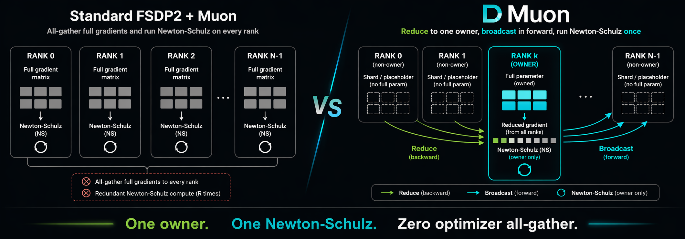

# DMuon

> Dedicated ownership for Muon on PyTorch FSDP2 \
> **One owner. One Newton-Schulz. Zero optimizer all-gather.**

<p align="center">
  
</p>

<p align="center">
  <a href="https://pytorch.org/"></a>
  <a href="#hsdp-multi-node"></a>
  <a href="#tp-compatibility"></a>
  
  <a href="LICENSE"></a>
  
</p>

<p align="center">
  📖 <a href="https://starrickliu.github.io/dmuon/"><strong>Documentation</strong></a>
  &nbsp;·&nbsp;
  🚀 <a href="https://starrickliu.github.io/dmuon/getting-started/quickstart/"><strong>Quick Start</strong></a>
  &nbsp;·&nbsp;
  🌐 <a href="https://starrickliu.github.io/dmuon/guides/hsdp/"><strong>HSDP Guide</strong></a>
  &nbsp;·&nbsp;
  🏛️ <a href="https://starrickliu.github.io/dmuon/design/architecture/"><strong>Architecture</strong></a>
  &nbsp;·&nbsp;
  🇨🇳 <a href="https://starrickliu.github.io/dmuon/zh/"><strong>中文文档</strong></a>
</p>

DMuon makes [Muon](https://arxiv.org/abs/2502.16982) work efficiently with PyTorch FSDP2 by assigning each matrix parameter to a single **owner rank**.

Instead of all-gathering full gradients and redundantly running Newton-Schulz on every rank, DMuon uses a dedicated ownership model:

- **Broadcast** full parameters from owner in forward
- **Reduce** gradients to owner in backward
- **Owner-only Newton-Schulz** in the optimizer step

This eliminates extra optimizer communication and cuts redundant NS compute from R times to 1 time.

## Why DMuon?

Standard FSDP2 makes matrix optimizers inefficient.

Matrix optimizers (Muon, Shampoo, SOAP) need the **full gradient matrix** for Newton-Schulz orthogonalization. With standard FSDP2, this means either:

- All-gathering the full gradient to every rank (**extra communication**)
- Every rank running NS independently (**R times redundant compute**)

DMuon eliminates both. The owner already has the complete gradient after `reduce`, and only the owner runs NS.

| | Standard FSDP2 + Muon | DMuon |
|---|---|---|
| Optimizer comm | all-gather full gradient | **zero** |
| NS compute | R times (every rank) | **1 time** (owner only) |
| HSDP (multi-node) | replicate all-reduce + replicated state + redundant NS across replicas | single-owner across entire mesh + async forward-hidden broadcast |

## Getting Started

### Install

```bash
git clone https://github.com/StarrickLiu/dmuon && cd dmuon
pip install -e .
```

### 3-Line Integration

```python
import dmuon  # auto-patches FSDP2

# Mark which params get dedicated ownership (auto-balanced across ranks)
dmuon.dedicate_params(model, dp_mesh, predicate=lambda n, p: "proj" in n)

# Use FSDP2 as usual — dedicated params are handled automatically
for layer in model.layers:
    fully_shard(layer, mesh=dp_mesh)
fully_shard(model, mesh=dp_mesh)
```

That's it. Forward broadcast, backward reduce, and owner-only optimizer execution are handled by hooks.

### Full Training Example

```python
import torch
from torch.distributed.fsdp import fully_shard
from torch.distributed.device_mesh import init_device_mesh
import dmuon

# Setup
mesh = init_device_mesh("cuda", (world_size,))
model = MyModel().cuda()

# Apply DMuon + FSDP2
dmuon.dedicate_params(model, mesh, predicate=lambda n, p: "proj" in n)
for layer in model.layers:
    fully_shard(layer, mesh=mesh)
fully_shard(model, mesh=mesh)

# Muon optimizer (handles dedicated + FSDP2 params automatically)
optimizer = dmuon.Muon(model, lr=0.02, ns_steps=5, adamw_lr=1e-3)

# Training loop
for batch in dataloader:
    optimizer.zero_grad()
    loss = model(batch).loss
    loss.backward()
    optimizer.step()
```

### HSDP (Multi-Node) <a id="hsdp-multi-node"></a>

Scale beyond one node with a 2D `(replicate, shard)` mesh — DMuon handles the two-stage gradient reduce (shard → replicate) and hides the post-step replicate broadcast inside the **next** iteration's forward pass.

```python
from torch.distributed.device_mesh import init_device_mesh
import dmuon

# 2D HSDP mesh: e.g. 2 nodes × 8 GPUs/node
hsdp = init_device_mesh(
    "cuda", (replicate_size, shard_size),
    mesh_dim_names=("replicate", "shard"),
)

dmuon.dedicate_params(
    model, hsdp["shard"],
    predicate=lambda n, p: "proj" in n and p.ndim == 2,
    replicate_mesh=hsdp["replicate"],          # ← the HSDP knob
)
for layer in model.layers:
    fully_shard(layer, mesh=hsdp)              # ← FSDP2 uses the 2D mesh
fully_shard(model, mesh=hsdp)

optimizer = dmuon.Muon(
    model, lr=0.02,
    replicate_async=True,                      # default: hide broadcast in forward
)
```

What you get out of the box:

- **Two-stage grad reduce** — `AVG` over shard, then `AVG` over replicate; total divisor = `G·R`, matching a single all-reduce over the world
- **Async post-step broadcast** — updated `_owned_data` fans out to replicate peers on a dedicated stream; the wait is consumed per-layer in the next forward
- **Z2 / Z3 packed-buffer lifecycle** — pass `reshard_after_forward=False` on `dedicate_params()` for **DMuon-Z2** (comm-optimal `2(N-1)/N · P_M` bytes/step, higher memory); default `True` gives **DMuon-Z3** (memory-efficient, matches FSDP2 ZeRO-3 convention). Mirrors `fully_shard(..., reshard_after_forward=...)` for non-Muon params — pick memory budget independently of the ownership primitive
- **Auto-fallback** — a single-direction protocol degrades a group to sync if blocked-waits sustain > 100 μs (tunable); reset via `dmuon.reset_replicate_fallback(model)`
- **Bit-identical** to sync baseline (validated on 4 GPU G=2 R=2) — safe to turn on by default
- **Checkpoint-safe** — `get_model_state_dict` drains pending async state before reading

Full API, profiling, and troubleshooting in the [HSDP guide](https://starrickliu.github.io/dmuon/guides/hsdp/).

### Checkpoint Save / Load

```python
import dmuon

# Save (all ranks call get, rank 0 saves to disk)
model_sd = dmuon.get_model_state_dict(model)
optim_sd = dmuon.get_optimizer_state_dict(model, optimizer)
if dist.get_rank() == 0:
    torch.save({"model": model_sd, "optim": optim_sd}, "checkpoint.pt")
dist.barrier()

# Load (resume training from checkpoint)
ckpt = torch.load("checkpoint.pt", map_location="cpu")
dmuon.set_model_state_dict(model, ckpt["model"])
dmuon.set_optimizer_state_dict(model, optimizer, ckpt["optim"])
```

Model state dicts are in standard format — compatible with single-GPU `torch.save`/`torch.load` and HuggingFace checkpoints. Loading a pretrained checkpoint (without optimizer state) works the same way:

```python
pretrained_sd = torch.load("pretrained_model.pt", map_location="cpu")
dmuon.set_model_state_dict(model, pretrained_sd)
```

## How It Works

DMuon runs **alongside** FSDP2 — each manages a disjoint set of parameters:

**Dedicated parameters** (proj layers — q/k/v/o/gate/up/down_proj):
- Owner rank stores the full parameter; others hold empty placeholders
- Forward: broadcast from owner
- Backward: reduce to owner
- Optimizer: owner runs Newton-Schulz (zero communication)

**Standard parameters** (layernorm, embedding, etc.):
- Normal FSDP2 sharding (1/R shard per rank)
- Forward: all-gather; Backward: reduce-scatter
- Optimizer: every rank updates its shard (AdamW)

### FSDP2 Composition

DMuon integrates with FSDP2 through hooks on the same module, with no modifications to FSDP2 internals:

1. `dedicate_params()` marks parameters with `_dedicated_owner_rank`
2. On `import dmuon`, a monkey-patch makes `fully_shard()` auto-skip marked params
3. DMuon registers its own forward/backward hooks for broadcast/reduce

### Balanced Partition

`dedicate_params` uses LPT (Longest Processing Time) with two constraints:

- **Global balance**: each rank owns ~model_size/R total parameters
- **Same-layer concurrency**: parameters in the same layer go to different ranks, enabling concurrent broadcasts
- **Small param packing**: k_proj + v_proj in the same layer share one owner for packed broadcast

### TP Compatibility

Works with Tensor Parallelism — apply TP first, then DMuon:

```python
parallelize_module(layer.mlp, tp_mesh, {...})   # TP first
dmuon.dedicate_params(model, dp_mesh, ...)      # DMuon second
fully_shard(layer, mesh=dp_mesh)                # FSDP2 third
```

Within a DP group, all ranks share the same TP position, so broadcasting a TP shard is correct.

## Benchmarks

**8 x A800-SXM4-80GB, bf16, seq=2048, bs=2**

### Total Step Time

| Model | FSDP2+AdamW | FSDP2+Muon | DMuon | vs AdamW |
|:------|----------:|-----------:|------:|------:|
| Qwen2.5-1.5B | 328 ms | 684 ms | 340 ms | +4% |
| Llama-3.2-3B | 599 ms | 1,810 ms | 660 ms | +10% |
| Qwen2.5-7B | 1,108 ms | 3,985 ms | 1,222 ms | +10% |
| Llama-3.1-8B | 1,188 ms | 4,617 ms | 1,349 ms | +13% |

### Optimizer-Only Time

| Model | AdamW | FSDP2+Muon | DMuon | Speedup |
|:------|------:|-----------:|------:|------:|
| Qwen2.5-1.5B | 17 ms | 373 ms | 31 ms | **12.0x** |
| Llama-3.2-3B | 27 ms | 1,232 ms | 99 ms | **12.5x** |
| Qwen2.5-7B | 53 ms | 2,917 ms | 189 ms | **15.5x** |
| Llama-3.1-8B | 56 ms | 3,468 ms | 260 ms | **13.3x** |

DMuon adds **4-13% total overhead** vs FSDP2+AdamW — the cost of using a matrix optimizer. The optimizer step itself is **12-15x faster** than naive FSDP2+Muon, from two factors: 1/8 parameter sharding (~8x) and Gram NS with SYRK kernel (~1.6x).

All benchmarks verified: every rank produces identical loss values. See [docs/llm_benchmark.md](docs/llm_benchmark.md) for detailed phase breakdown.

## 📖 Documentation

Full documentation is hosted on GitHub Pages: **[starrickliu.github.io/dmuon](https://starrickliu.github.io/dmuon/)**

<table>
<tr>
<td width="25%" align="center">
<a href="https://starrickliu.github.io/dmuon/"><b>Home</b></a><br>
<sub>Project overview</sub>
</td>
<td width="25%" align="center">
<a href="https://starrickliu.github.io/dmuon/getting-started/quickstart/"><b>Quick Start</b></a><br>
<sub>5-minute setup</sub>
</td>
<td width="25%" align="center">
<a href="https://starrickliu.github.io/dmuon/guides/training/"><b>Training Guide</b></a><br>
<sub>Full 1D workflow</sub>
</td>
<td width="25%" align="center">
<a href="https://starrickliu.github.io/dmuon/guides/hsdp/"><b>HSDP Guide</b></a><br>
<sub>Multi-node 2D mesh</sub>
</td>
</tr>
<tr>
<td width="25%" align="center">
<a href="https://starrickliu.github.io/dmuon/getting-started/concepts/"><b>Core Concepts</b></a><br>
<sub>How ownership works</sub>
</td>
<td width="25%" align="center">
<a href="https://starrickliu.github.io/dmuon/design/architecture/"><b>Architecture</b></a><br>
<sub>Three-way decoupling design</sub>
</td>
<td width="25%" align="center">
<a href="https://starrickliu.github.io/dmuon/reference/api/"><b>API Reference</b></a><br>
<sub>Function signatures</sub>
</td>
<td width="25%" align="center">
<a href="https://starrickliu.github.io/dmuon/zh/"><b>🇨🇳 中文文档</b></a><br>
<sub>Full Chinese translation</sub>
</td>
</tr>
</table>

## Roadmap

### Done

- [x] Core ownership model (broadcast/reduce/owner-only NS)
- [x] Balanced partition with concurrency constraints (2D-aware LPT over G·R slots)
- [x] FSDP2 composition (zero modification to FSDP2 internals)
- [x] **HSDP native support** — 2D mesh, two-stage reduce (shard + replicate), async forward-hidden broadcast, fallback protocol, checkpoint restart
- [x] TP compatibility
- [x] LLM step time benchmarks (Qwen2.5, Llama-3, 8xA800)
- [x] Gram NS with TP SYRK decomposition (O(m^2) TP comm instead of O(mn))
- [x] CuteDSL SYRK kernel (5/7 Gram NS ops, 1.4-1.5x E2E speedup)
- [x] Prefetch pipeline (forward + backward)
- [x] Gradient accumulation (default + `no_sync` context manager)
- [x] State dict save/load (compatible with single-GPU, HuggingFace, and HSDP restart)
- [x] **Full user documentation** — English + 中文; installation / quickstart / guides / design / API / FAQ / troubleshooting (v2 docs)

### In Progress

- [ ] Convergence validation (loss curves vs AdamW vs Muon)
- [ ] Naive Muon baselines (DDP / FSDP-ZeRO2 / FSDP-ZeRO3) for per-byte A/B traces
- [ ] Multi-node scaling benchmarks (16-256 GPUs, Qwen2.5-7B/14B)

### Planned

- [ ] Larger model benchmarks (14B+, 32B)
- [ ] Shampoo / SOAP under the same ownership primitive
- [ ] DeepSpeed ZeRO integration
- [ ] Communication & memory profiling reports
- [ ] CI/CD (GitHub Actions)
- [ ] torch.compile support

See [TODO.md](TODO.md) for details.

## Acknowledgments

DMuon's dedicated-ownership primitive builds on foundational work by [Rajbhandari et al., 2020 (ZeRO-1)](https://arxiv.org/abs/1910.02054) and [Shi et al., 2023 (Distributed Shampoo)](https://arxiv.org/abs/2309.06497). The Gram Newton-Schulz iteration is adapted from [Dao-AILab/gram-newton-schulz](https://github.com/Dao-AILab/gram-newton-schulz) and the [CuteDSL SYRK kernel from quack](https://github.com/Dao-AILab/quack) by Tri Dao et al. Concurrent work [Canzona (Wang et al., 2026)](https://arxiv.org/abs/2602.06079) explores a parallel extension of the same primitive within Megatron-LM's TP + ZeRO-1 setting.

## Citation

```bibtex
@misc{DMuon,
  title   = {DMuon: Dedicated Parameter Ownership for Distributed Muon Training},
  author  = {Xingchen Liu},
  year    = {2026},
  url     = {https://github.com/StarrickLiu/dmuon}
}
```

DMuon builds on Gram Newton-Schulz. If you use the Gram NS iteration, please also cite:

```bibtex
@misc{GramNewtonSchulz,
  title   = {Gram Newton-Schulz},
  author  = {Jack Zhang and Noah Amsel and Berlin Chen and Tri Dao},
  year    = {2026},
  url     = {https://dao-ailab.github.io/blog/2026/gram-newton-schulz/}
}
```

## License

Apache 2.0
