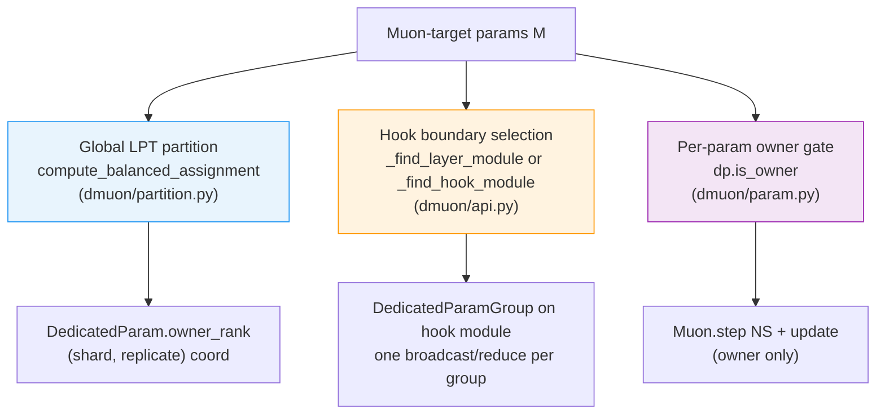
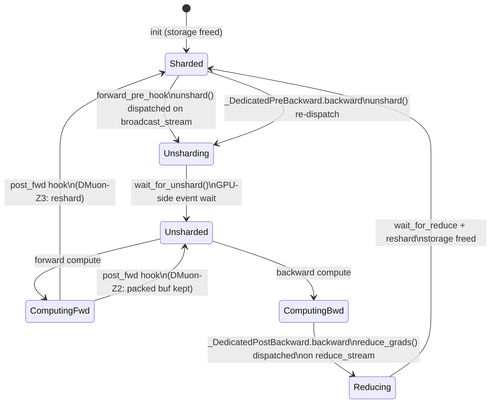
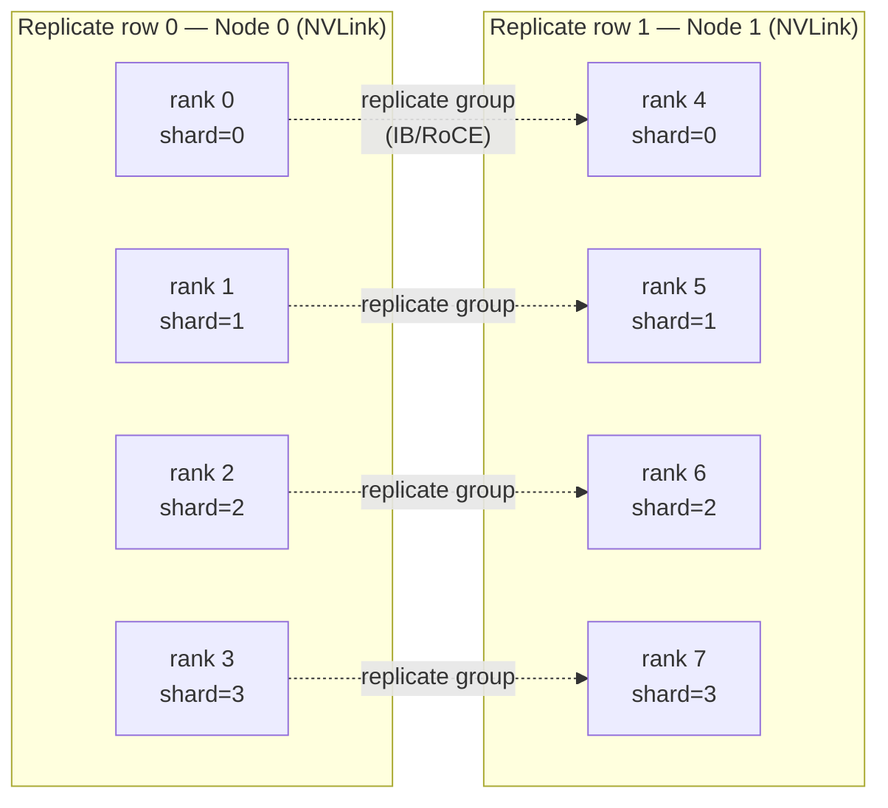
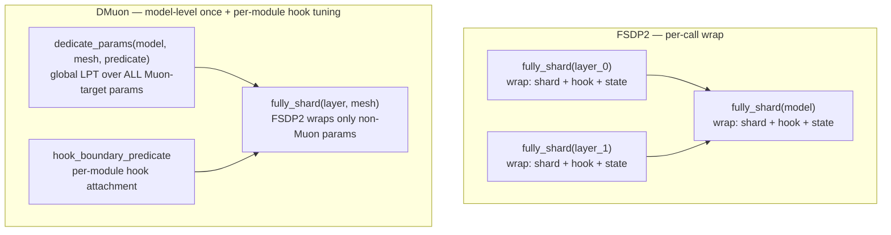

# Architecture

!!! tip "TL;DR"
    DMuon separates three orthogonal concerns — **global partition (LPT)**, **per-module hook boundary**, and **per-param owner step**. This decoupling is the key design choice distinguishing DMuon from FSDP2 and from prior ownership-based work. Understanding it is the key to reading the codebase.

---

## 1. The Matrix-Optimizer Atomicity Constraint

Matrix optimizers — Muon ([Kosson et al., 2024](https://arxiv.org/abs/2409.12191); [Jordan et al., 2024](https://arxiv.org/abs/2409.20325)), Shampoo ([Gupta et al., 2018](https://arxiv.org/abs/1802.09568)), SOAP ([Vyas et al., 2024](https://arxiv.org/abs/2409.11321)) — require the **complete gradient matrix** $G \in \mathbb{R}^{m \times n}$ at optimizer step time. For Muon specifically, the Newton-Schulz orthogonalization iterates:

$$X_{t+1} = \alpha X_t + \beta X_t X_t^\top X_t + \gamma X_t (X_t^\top X_t)^2$$

Each iteration involves multiplying the full matrix by its own transpose. A row-shard or column-shard of $G$ is mathematically insufficient — you would need an all-gather to reconstruct the full matrix before running NS.

**Standard FSDP2** shards each parameter uniformly across ranks (ZeRO-2 or ZeRO-3). Under ZeRO-3, every rank holds $1/R$ of each parameter and $1/R$ of each parameter's gradient. For matrix optimizers this creates a painful choice:

- **All-gather the full gradient to every rank** before the optimizer step — $O(P_M)$ extra communication per step, where $P_M$ is the total size of Muon-target parameters.
- **Run NS redundantly on every rank** after the all-gather — $R\times$ redundant compute, same memory.

Neither is acceptable at scale. DMuon eliminates both via dedicated ownership.

---

## 2. Dedicated Ownership — The Primitive

In DMuon, **one rank owns each Muon-target parameter's full lifecycle**:

- **Init**: owner allocates `_owned_data` (the authoritative full-precision copy); other ranks hold lightweight placeholder `Parameter` objects.
- **Forward**: owner broadcasts `_owned_data` to shard peers via one NCCL call per owner (coalesced via `dist._coalescing_manager`).
- **Backward**: each rank accumulates a partial gradient; a `dist.reduce` to the owner sends the averaged gradient.
- **Optimizer step**: only the owner runs Newton-Schulz + momentum + weight-decay + parameter update, operating entirely on local memory.
- **Post-step** (HSDP): owner broadcasts the updated `_owned_data` to replicate peers via the inter-node replicate group.

The owner never needs an all-gather; the full gradient lands at the owner via `reduce`. No extra communication; no redundant NS.

### Lineage

The dedicated-ownership primitive is not new to DMuon. DMuon formalizes and extends it to the PyTorch DP family:

- [**Rajbhandari et al., 2020 (ZeRO-1)**](https://arxiv.org/abs/1910.02054) — optimizer state sharding with a single owner per parameter shard; established the ownership model for optimizer states.
- [**Shi et al., 2023 (Distributed Shampoo)**](https://arxiv.org/abs/2309.06497) — applied a similar ownership structure for Shampoo's preconditioning matrices.
- [**Wang et al., 2026 (Canzona)**](https://arxiv.org/abs/2602.06079) — concurrent parallel work that extends the same primitive within Megatron-LM's TP + ZeRO-1 setting.
- **DMuon 2026** — applies the primitive to PyTorch FSDP2 / HSDP with a global LPT partition, hook-boundary decoupling, and async forward-hidden broadcast.

DMuon does not claim to invent the primitive. Its contribution is the three-way decoupling described next, and the HSDP-native scheduling that hides inter-node broadcast latency.

---

## 3. The Three-Way Decoupling (Key Design Contribution)

Standard FSDP2 collapses three decisions into one: `fully_shard(module)` simultaneously defines the **sharding granularity**, the **hook-attachment boundary**, and the **optimizer partition** — all coincide because uniform per-tensor sharding makes them equivalent. DMuon's LPT partition breaks this equivalence. The three dimensions **must** be decoupled:

### 3.1 Partition (Global LPT)

`compute_balanced_assignment` in `dmuon/partition.py` runs a **Longest Processing Time (LPT)** greedy assignment over *all* Muon-target parameters at once. LPT is an NP-hard bin-packing heuristic that, for homogeneous items, guarantees at most $\frac{4}{3} - \frac{1}{3R}$ of optimal imbalance.

Key constraints baked into the algorithm:

1. **Same-layer concurrency**: parameters in the same transformer layer go to different owner slots. This enables concurrent shard-dim broadcasts (one NCCL per owner), rather than serializing all layers through rank 0.
2. **Small-param packing**: parameters below `SMALL_PARAM_THRESHOLD` (5 M elements by default) in the same layer are merged into one allocation unit — they share an owner and travel in one packed broadcast call.
3. **2D slots in HSDP**: when `replicate_mesh` is provided, LPT runs over all `G·R` slots on the full 2D mesh, distributing work across both shard and replicate dimensions simultaneously.

**Why global?** A per-module LPT would have local information only. With R=8 and 7 projection matrices per layer, a per-layer LPT assigns at most 7 distinct ranks — leaving rank 7 idle in every layer (12.5% of capacity wasted). The global view allows the scheduler to use rank 7 heavily for layers where it happens to be the least-loaded slot.

### 3.2 Hook Boundary (Per-Module)

The **hook boundary** determines which module registers the pre/post-forward hooks that trigger broadcast and reduce. It controls broadcast coalescing granularity.

Two modes:

- **Default heuristic** (`hook_boundary_predicate=None`): `_find_layer_module` extracts the `layers.N` or `blocks.N` ancestor from each parameter's FQN. All dedicated params within `layers.3` share one `DedicatedParamGroup` and one pair of forward hooks — their broadcasts coalesce into a single NCCL call per owner.
- **Explicit predicate** (`hook_boundary_predicate=(module) -> bool`): `_find_hook_module` walks ancestors of each dedicated param and attaches the hook at the lowest ancestor where the predicate returns True. This mirrors FSDP2's `fully_shard(module, ...)` pattern, giving users the same level of explicit control.

The hook boundary is **independent of the partition**: two parameters owned by rank 0 and rank 3 can live in the same hook boundary (and thus the same `DedicatedParamGroup`), triggering two simultaneous broadcasts in parallel during one forward pre-hook call.

### 3.3 Owner Step (Per-Param)

After `reduce_grads` completes, `DedicatedParam.is_owner` gates the optimizer step:

```python
if dp.is_owner:
    # run Newton-Schulz + momentum + update on dp._owned_data
```

`is_owner` encodes both shard and replicate dimensions in HSDP mode — only the single global owner (shard=`owner_shard`, replicate=`owner_replicate`) runs the update. All other ranks skip the NS computation entirely.

### Diagram



These three dimensions are **independent**: changing the hook boundary does not change who owns which parameter; changing the partition does not change where hooks are attached; changing the optimizer gate is purely a runtime read of `is_owner`.

---

## 4. Lifecycle — What Happens Per Step

### State Diagram



### Narrative Walkthrough

**Step n, forward:**

1. Layer `i`'s `_pre_forward` hook fires. It first calls `_pre_forward_wait()` to consume any pending async replicate broadcast from step `n-1` (HSDP only). Then `unshard()` allocates the packed buffer storage and dispatches NCCL broadcasts (per owner, coalesced) on `broadcast_stream`. Simultaneously, a forward-prefetch dispatches layer `i+1`'s broadcast.
2. `wait_for_unshard()` places a GPU-side event wait on the current stream — the compute kernel queue stalls until broadcasts land.
3. Forward compute runs with full parameters on every rank.
4. `_post_forward` fires: in **DMuon-Z3** mode, `reshard()` frees the packed buffer storage (mirrors FSDP2's ZeRO-3). In **DMuon-Z2** mode (`reshard_after_forward=False`), the packed buffer stays resident, eliminating the backward re-broadcast.

**Step n, backward:**

5. `_DedicatedPreBackward.backward` fires (registered on the forward output). It calls `unshard()` + `wait_for_unshard()` — a no-op in DMuon-Z2 since the buffer is already live. It also queues the autograd-engine root callback fallback.
6. Backward compute runs; autograd deposits gradients onto `_unsharded_param.grad` (persistent Parameter object — Phase 2 reuse means no grad-transfer step is needed).
7. `_DedicatedPostBackward.backward` fires (registered on the forward input): `reduce_grads()` dispatches stage-1 shard-reduce on `reduce_stream` (coalesced per owner), then stage-2 replicate-reduce on `replicate_broadcast_stream` (HSDP only). `reshard()` frees storage.

**Step n, optimizer:**

8. `Muon.step()` iterates dedicated params; `is_owner` gate runs NS + momentum + update for global owners only. Non-owners skip.
9. (HSDP) `replicate_broadcast_async()` dispatches the updated `_owned_data` to shard-column peers on `replicate_broadcast_stream`. The event is stored in `_replicate_broadcast_state` and consumed by step `n+1`'s `_pre_forward_wait()`.

---

## 5. HSDP Extensions

### 2D Mesh Layout



Each rank belongs to exactly one `shard_group` (size `G`) and one `replicate_group` (size `R`). The global owner of a parameter occupies one cell `(owner_shard, owner_replicate)` in this grid. All other cells in the same shard column (`*`, `owner_shard`) hold a copy of `_owned_data` for the shard-dim broadcast.

### Two-Stage Gradient Reduce

Gradient averaging in HSDP is a pipeline of two independent reduces:

1. **Stage 1 — shard reduce** (`dist.reduce`, `ReduceOp.AVG`, on `dp_group`): averages gradient across the `G` ranks in one replicate row, landing the shard-averaged result on the shard-owner rank. Runs on `reduce_stream` (high priority, intra-node NVLink).
2. **Stage 2 — replicate reduce** (`dist.reduce`, `ReduceOp.AVG`, on `replicate_group`): averages the stage-1 outputs across the `R` replicate rows, landing the globally averaged gradient on the global owner rank. Runs on `replicate_broadcast_stream` (default priority, inter-node IB/RoCE).

Net divisor is `G·R`, which equals a single all-reduce over the world. The two-stage pipeline uses disjoint streams so stage-1 and stage-2 of different layers can overlap.

### Cross-Step Async Forward-Hidden Broadcast

After `optimizer.step()`, the global owner has new `_owned_data`. This must be synchronized to all `R-1` shard-column peers before the next forward. In naive sync mode (`replicate_async=False`) this wait blocks the optimizer window. The async path (`replicate_async=True`, default) decouples the dispatch and the wait:

- **Dispatch** (`replicate_broadcast_async`): fires the NCCL broadcast on `replicate_broadcast_stream` immediately after `optimizer.step()`, records a `ReplicateBroadcastState` holding an event + tensor ref. Returns immediately.
- **Wait** (`_pre_forward_wait`): consumed by the **next iteration's** `_pre_forward` hook, just before `unshard()` reads `_owned_data`. If the IB transfer completed during forward compute of prior layers, the wait is effectively zero.

If the replicate-axis transfer cannot hide behind the next forward pass, use
`replicate_async=False` to run the same communication synchronously while
debugging the network or hook boundary.

### Priority Assignment

Shard-dim collectives (`broadcast_stream`, `reduce_stream`) use CUDA stream priority `-1` (high). Replicate-dim collectives (`replicate_broadcast_stream`) use default priority. This mirrors FSDP2's convention where intra-node all-gather/reduce-scatter get high priority and inter-node all-reduce gets default — avoiding NVLink starvation from IB-side traffic.

---

## 6. Composition with FSDP2

### The Monkey-Patch Mechanism

On `import dmuon`, `dmuon.install_patch()` wraps `_get_managed_states` in FSDP2's init path. The patched version adds any parameter carrying `_dedicated_owner_rank` to `ignored_params` before delegating to the original function:

```python
def _patched_get_managed_states(modules, ignored_params=None):
    if ignored_params is None:
        ignored_params = set()
    for module in modules:
        for _, param in module.named_parameters(recurse=False):
            if hasattr(param, "_dedicated_owner_rank"):
                ignored_params.add(param)
    return _original_fn(modules, ignored_params)
```

This means subsequent `fully_shard()` calls silently skip dedicated parameters. No change to FSDP2 internals — the patch touches a single private function and is installed automatically by importing `dmuon`.

### Why This Is Not an Adapter

DMuon does not sit "on top of" FSDP2 as an adapter layer. The two systems manage **disjoint parameter sets** and run their collectives on **disjoint streams**:

- FSDP2 manages non-Muon params: all-gather on `all_gather_stream` (high pri), reduce-scatter on `reduce_scatter_stream` (high pri).
- DMuon manages Muon-target params: broadcast on `broadcast_stream` (high pri), reduce on `reduce_stream` (high pri), replicate on `replicate_broadcast_stream` (default pri).

Both systems register hooks on the same module objects, but hook registration order is deliberate: DMuon uses `register_forward_pre_hook(..., prepend=False)` (appends after FSDP2's `prepend=True` hooks), ensuring FSDP2's own pre-hooks fire first. There is no shared state, no inheritance, and no API wrapping between the two systems.

### Three Streams Aligned with FSDP2 Convention

| Stream | Priority | Purpose |
|---|---|---|
| `broadcast_stream` | High (-1) | Shard-dim parameter broadcasts (intra-node NVLink) |
| `reduce_stream` | High (-1) | Shard-dim gradient reduces (intra-node NVLink) |
| `replicate_broadcast_stream` | Default | Replicate-dim post-step broadcasts (inter-node IB/RoCE) |

FSDP2 uses the same convention: high priority for `all_gather_stream` / `reduce_scatter_stream` (intra-node), default for `all_reduce_stream` (inter-node replicate). Aligning priorities ensures the two systems do not compete for the same CUDA stream resources.

---

## 7. Contrast with FSDP2's Compositional API

### FSDP2's Per-Call Granularity



### The Root Reason for the Difference

FSDP2's `fully_shard(module)` is called once per module and defines that module's sharding independently. This works because uniform per-tensor sharding is embarrassingly parallel — each module's sharding decision is local and optimal.

DMuon's LPT cannot make local decisions. A per-module LPT would see only the parameters within that module — perhaps 8 projection matrices — and assign them to 8 ranks. But with `R=8` and 7 parameters per layer, rank 7 would be idle in every layer (12.5% idle). The global LPT sees all layers simultaneously and can pack rank 7 with parameters from layers where it happens to be cheapest.

The consequence is that `dedicate_params(model, mesh, predicate)` is called **once on the whole model**, and `hook_boundary_predicate` is a separate knob for adjusting per-module hook granularity after the partition is fixed. This is a deliberate design inversion from FSDP2's API.

---

## 8. Correctness Invariants

These invariants are maintained across every training step and are tested in `tests/distributed/test_hsdp_correctness.py` and `test_hsdp_async_correctness.py`:

**I1 — Single global owner:**
`dp.is_owner == True` if and only if this rank's `(shard_rank, replicate_rank)` coordinates both match `dp.owner_rank`. In 1D mode, `replicate_rank` is fixed at 0, so the condition collapses to `shard_rank == owner_shard`.

**I2 — Shard-column `_owned_data` presence:**
`dp._owned_data is not None` on **every** rank in the owner's shard column (i.e., for all replicate indices `r` at `owner_shard`). This is required because the shard-dim broadcast sender is whichever rank in the current replicate row matches `owner_shard` — that rank must have a valid `_owned_data` to copy into the packed buffer before the broadcast. The global owner holds the authoritative copy; shard-column peers receive it via the post-step replicate broadcast.

**I3 — Exclusive grad ownership:**
After `wait_for_reduce()` completes, only the **global owner** has a valid `_reduced_grad`. Non-owner ranks have `_reduced_grad = None`. The optimizer step reads `_reduced_grad` under the `is_owner` gate — any inadvertent read by a non-owner would raise `AttributeError` or return `None`, which is an immediate correctness signal.

**I4 — Replicate-peer consistency:**
After `replicate_broadcast_sync()` or after `_pre_forward_wait()` consumes the async `ReplicateBroadcastState`, all ranks in the owner's shard column have identical `_owned_data` contents. The next shard-dim broadcast therefore delivers the same weights to all non-owner ranks in both replicate rows.

### Test Harness

```
tests/distributed/test_hsdp_correctness.py
    — bit-identical loss trajectory (sync vs async, 10 steps, G=2 R=2)
tests/distributed/test_hsdp_async_correctness.py
    — async replicate broadcast produces same optimizer state as sync path
```

Run with:
```bash
torchrun --nproc_per_node=4 tests/distributed/test_hsdp_correctness.py
torchrun --nproc_per_node=4 tests/distributed/test_hsdp_async_correctness.py
```

---

## See Also

- [Core Concepts](../getting-started/concepts.md) — ownership model introduction for new users
- [Quick Start](../getting-started/quickstart.md) — 5-minute setup
- [HSDP Guide](../guides/hsdp.md) — full HSDP API reference and tuning
- [Custom Hook Boundaries](../guides/custom-hook-boundaries.md) — `hook_boundary_predicate` in practice
- [Z2 vs Z3 Modes](../guides/z2-z3-modes.md) — packed-buffer lifecycle and memory/comm tradeoffs
- [API Reference](../reference/api.md) — `dedicate_params` and `Muon` full signatures
- [Communication Cost Analysis](../reference/communication-cost.md) — per-byte analysis of every collective
