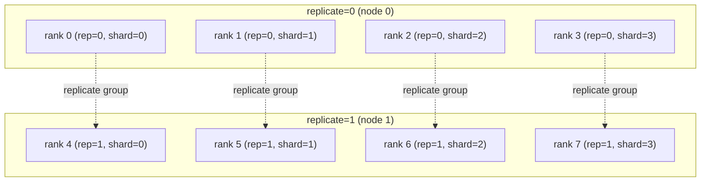
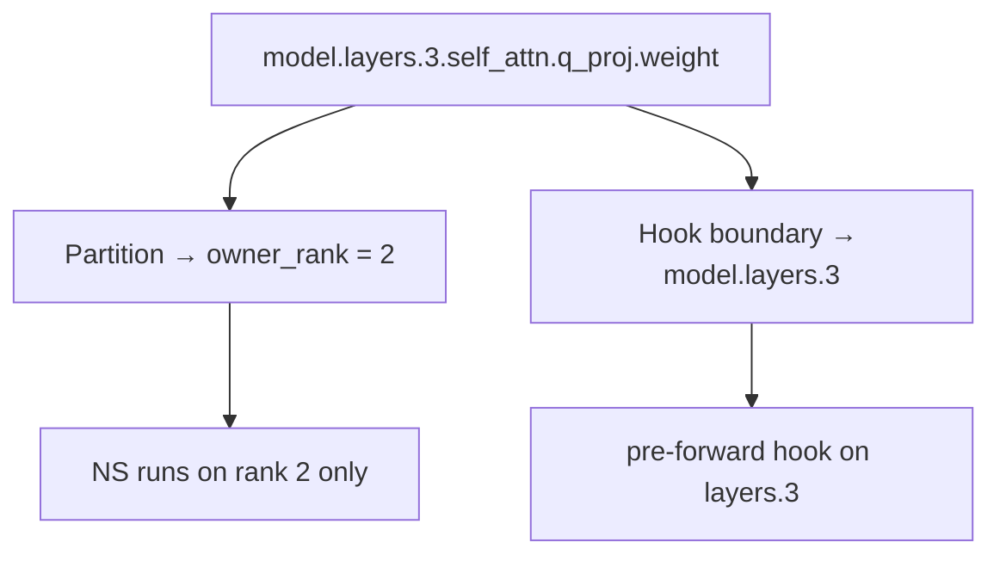

# Core Concepts

!!! tip "TL;DR"
    DMuon has three key concepts: **dedicated ownership** (one rank owns each
    matrix parameter and runs Newton-Schulz alone), **DMuon-Z2/Z3 modes**
    (packed-buffer lifetime, mirroring FSDP2's `reshard_after_forward`),
    and **hook boundaries** (where hooks attach — independent of partition).

---

## 1. Dedicated Ownership

### The problem

Matrix optimizers like [Muon](https://arxiv.org/abs/2502.16982) need the
**full gradient matrix** for Newton-Schulz:

$$
X_{k+1} = a_k X_k + b_k (X_k X_k^\top) X_k + c_k (X_k X_k^\top)^2 X_k
$$

FSDP2 leaves each rank with 1/R of the gradient after reduce-scatter. To run
Newton-Schulz you must either all-gather (O(mn) extra comm) or run NS on every
rank (R× redundant compute). On an 8B model with 8 GPUs this adds 3–4× AdamW overhead.

### How dedicated ownership fixes it

Assign each Muon-target parameter to one **owner rank**. The owner stores the
full parameter; others hold empty placeholders. Per step:

1. **Forward broadcast** — owner sends full param to all shard peers
2. **Forward reshard** — non-owners discard after the layer forward
3. **Backward broadcast** — owner re-sends for gradient computation
4. **Backward reduce** — gradients averaged and delivered to owner only
5. **Owner NS update** — owner runs Newton-Schulz; zero additional communication
6. **AdamW on FSDP2 shards** — all ranks update non-dedicated params

```
          Standard FSDP2                 DMuon
          ==============                 =====
          R0    R1    R2    R3
q_proj:   [1/4] [1/4] [1/4] [1/4]  →   R0 owns full q_proj
k_proj:   [1/4] [1/4] [1/4] [1/4]  →   R0 owns full k_proj
v_proj:   [1/4] [1/4] [1/4] [1/4]  →   R1 owns full v_proj
o_proj:   [1/4] [1/4] [1/4] [1/4]  →   R1 owns full o_proj
gate:     [1/4] [1/4] [1/4] [1/4]  →   R2 owns full gate_proj
down:     [1/4] [1/4] [1/4] [1/4]  →   R3 owns full down_proj
ln:       [1/4] [1/4] [1/4] [1/4]      [1/4] [1/4] [1/4] [1/4]
```

### Lineage

Dedicated ownership as a distributed training primitive traces to **ZeRO-1**
(Rajbhandari et al., 2020), which partitioned optimizer state across ranks.
**Distributed Shampoo** (Shi et al., 2023) applied single-owner assignment
to Kronecker factors, demonstrating full-matrix computation without
gradient all-gathers. DMuon extends this to Muon's Newton-Schulz and
combines it natively with FSDP2 module-level sharding.

### Balanced partition

`dedicate_params()` uses **LPT (Longest Processing Time)** with two constraints:
global balance (~`total_params / R` per rank) and layer concurrency (same-layer
params on different ranks for concurrent broadcasts). In HSDP mode, balance
spans all `G × R` global owner slots.

---

## 2. HSDP and the 2D Mesh

HSDP uses a 2D `(replicate, shard)` device mesh. Each Muon-target parameter
has a single **global owner** at `(owner_shard, owner_replicate)`.



Per iteration: shard-group broadcast → two-stage reduce (AVG shard, AVG
replicate, net divisor G·R) → owner NS → post-step replicate broadcast.
With `replicate_async=True` (default) the replicate broadcast hides behind
the next forward's compute.

---

## 3. DMuon-Z2 vs DMuon-Z3

| Mode | `reshard_after_forward` | Packed-buffer | Bytes/step | Memory |
|------|------------------------|---------------|------------|--------|
| **DMuon-Z3** | `True` (default) | Freed after forward; re-broadcast in backward | `3(N-1)/N · P_M` | Transient per layer |
| **DMuon-Z2** | `False` | Resident through forward + backward | `2(N-1)/N · P_M` | `P_M` resident per shard rank |

Match DMuon's flag to FSDP2's flag for a consistent memory model:

```python
# ZeRO-3 (large models, default)
dmuon.dedicate_params(model, mesh, predicate=..., reshard_after_forward=True)
for layer in model.layers:
    fully_shard(layer, mesh=mesh)

# ZeRO-2 (comm-optimal, small/medium models)
dmuon.dedicate_params(model, mesh, predicate=..., reshard_after_forward=False)
for layer in model.layers:
    fully_shard(layer, mesh=mesh, reshard_after_forward=False)
```

See [Z2 vs Z3 Modes](../guides/z2-z3-modes.md) for the decision tree.

---

## 4. Hook Boundary vs Partition

Hook boundaries and parameter partition are **independent concerns**.

- **Partition** — global LPT; decides *which rank* owns each parameter
- **Hook boundary** — module where forward/backward hooks attach; decides
  *when* broadcast/reduce fire. Should match `fully_shard()` granularity.



**Default heuristic**: when `hook_boundary_predicate=None`, DMuon scans the
parameter's FQN for `layers.N` or `blocks.N` patterns — covers standard
Llama/GPT/BERT naming without configuration.

**Custom hook boundaries**: for ViT, MoE, or custom blocks, set
`hook_boundary_predicate` to select the hook module explicitly. DMuon
registers on the **lowest ancestor** where the predicate returns `True`.

```python
# ViT with "blocks.N" naming
dmuon.dedicate_params(
    model, mesh,
    predicate=lambda n, p: "proj" in n and p.ndim == 2,
    hook_boundary_predicate=lambda m: hasattr(m, "attn") and hasattr(m, "mlp"),
)
```

`hook_boundary_strict=True` (default) raises if any dedicated param has no
matching ancestor — prevents silent per-submodule hook degradation.

See [Custom Hook Boundaries](../guides/custom-hook-boundaries.md).

---

## 5. Composition with FSDP2 and TP

**FSDP2**: DMuon and FSDP2 manage disjoint parameter sets. A monkey-patch
installed at `import dmuon` makes `fully_shard()` skip `_dedicated_owner_rank`
params. Setup order must be: `import dmuon` → `dedicate_params` → `fully_shard`.

!!! warning "Order matters"
    Calling `fully_shard()` before `dedicate_params()` causes FSDP2 to shard
    Muon-target params before DMuon can claim them.

**Tensor Parallelism**: DMuon uses **Gram Newton-Schulz** — iterating on the
(d, d) Gram matrix instead of the full (m, n) parameter. Gram reconstruction
from TP shards costs O(d²) via a single all-reduce. Apply TP first, DMuon
second, FSDP2 third:

```python
parallelize_module(layer.mlp, tp_mesh, {...})    # TP first
dmuon.dedicate_params(model, dp_mesh, ...)       # DMuon second
fully_shard(layer, mesh=dp_mesh)                 # FSDP2 third
```

---

## Glossary

| Term | Definition |
|------|-----------|
| **Dedicated ownership** | One rank stores and updates the full parameter; others hold placeholders |
| **Muon-target parameters** | Parameters selected by `predicate` for dedicated ownership and Newton-Schulz |
| **Owner rank** | Rank that holds `_owned_data`, accumulates gradients, and runs Newton-Schulz |
| **Hook boundary** | Module where DMuon's pre/post-forward hooks are registered |
| **DMuon-Z2 / DMuon-Z3** | Packed-buffer lifecycle modes (`reshard_after_forward=False/True`) |
| **Newton-Schulz** | Iterative orthogonal polar factor algorithm used by Muon |
| **Replicate broadcast** | Post-step fan-out of `_owned_data` to replicate peers (HSDP only) |

---

## See Also

- [HSDP Guide](../guides/hsdp.md) — full 2D mesh walkthrough and async mode
- [Custom Hook Boundaries](../guides/custom-hook-boundaries.md) — ViT, MoE, non-standard architectures
- [Z2 vs Z3 Modes](../guides/z2-z3-modes.md) — memory/communication tradeoff
- [API Reference](../reference/api.md) — complete `dedicate_params` and `Muon` signatures
