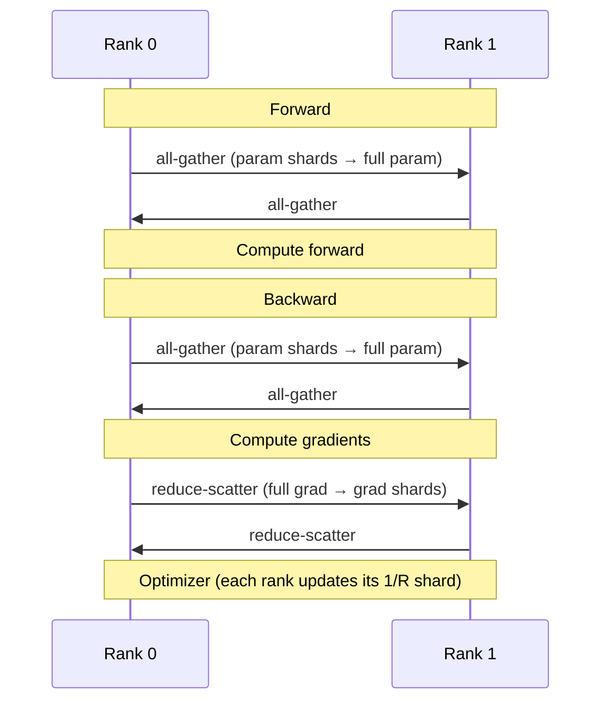
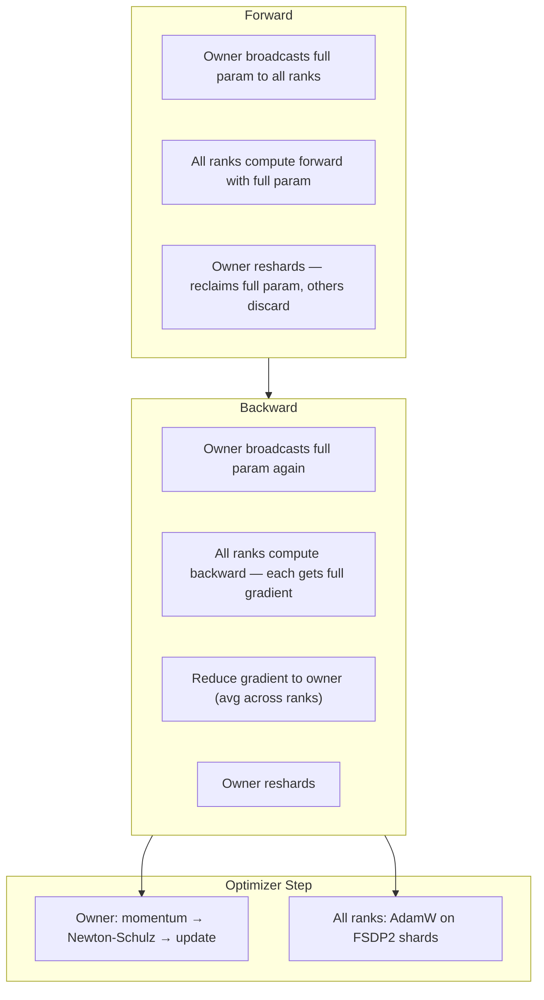

# Core Concepts

This page builds the mental model you need to understand DMuon. Read it once, and the rest of the documentation will make sense.

---

## FSDP2 Recap

PyTorch FSDP2 (`fully_shard`) distributes a model across R ranks by **sharding** parameters:

- Each rank stores **1/R** of every parameter
- **Forward**: all-gather the full parameter, compute, then discard
- **Backward**: all-gather again, compute gradients, then reduce-scatter so each rank gets 1/R of the gradient



This works perfectly for elementwise optimizers like **AdamW** — each rank updates its shard independently using its shard of the gradient.

## The Matrix Optimizer Problem

Matrix optimizers don't work elementwise. [Muon](https://arxiv.org/abs/2502.16982) needs the **full gradient matrix** to compute the Newton-Schulz orthogonal projection:

$$
X_{k+1} = a_k X_k + b_k (X_k X_k^T) X_k + c_k (X_k X_k^T)^2 X_k
$$

After FSDP2's reduce-scatter, each rank has only **1/R of the gradient**. To run Newton-Schulz, you need to:

1. **All-gather** the full gradient — O(mn) extra communication
2. **Run NS on every rank** — R times the same computation, completely redundant

For an 8B model on 8 GPUs, this all-gather + redundant compute adds **3-4x** overhead to every step.

## Dedicated Ownership

DMuon's insight: **if one rank has the full gradient, only that rank needs to run NS**.

Instead of FSDP2's symmetric sharding (every rank holds 1/R), DMuon assigns each matrix parameter to a single **owner rank**:

```
           Standard FSDP2                  DMuon
           ==============                  =====

           Rank 0  Rank 1  Rank 2  Rank 3
q_proj:    [1/4]   [1/4]   [1/4]   [1/4]     Rank 0 owns full q_proj
k_proj:    [1/4]   [1/4]   [1/4]   [1/4]     Rank 0 owns full k_proj
v_proj:    [1/4]   [1/4]   [1/4]   [1/4]     Rank 1 owns full v_proj
o_proj:    [1/4]   [1/4]   [1/4]   [1/4]     Rank 1 owns full o_proj
gate_proj: [1/4]   [1/4]   [1/4]   [1/4]     Rank 2 owns full gate_proj
up_proj:   [1/4]   [1/4]   [1/4]   [1/4]     Rank 2 owns full up_proj
down_proj: [1/4]   [1/4]   [1/4]   [1/4]     Rank 3 owns full down_proj
ln:        [1/4]   [1/4]   [1/4]   [1/4]     [1/4]  [1/4]  [1/4]  [1/4]
```

The owner stores the **complete** parameter. Other ranks hold nothing (empty placeholders). Non-matrix parameters (LayerNorm, embeddings) stay under FSDP2's normal sharding.

## Two Types of Parameters

DMuon splits model parameters into two disjoint groups:

### Dedicated Parameters

- Selected by the `predicate` you provide (typically 2D projection layers)
- Assigned to an owner rank via balanced partition
- Communication: **broadcast** (forward) + **reduce** (backward)
- Optimizer: **Muon** (Newton-Schulz), run by owner only

### Symmetric Parameters

- Everything not selected by the predicate (LayerNorm, embeddings, bias, etc.)
- Managed by FSDP2's standard sharding (1/R per rank)
- Communication: **all-gather** + **reduce-scatter** (standard FSDP2)
- Optimizer: **AdamW**, run by all ranks on their shards

!!! info "Why 'symmetric' and 'dedicated'?"
    "Symmetric" because every rank plays the same role — each holds an equal shard. "Dedicated" because one rank is *dedicated* to owning the full parameter — an asymmetric, specialized role.

## Data Flow

Here is the complete data flow for one training step:



Step by step:

1. **Forward broadcast**: The owner sends its full parameter to all ranks. Every rank computes forward with the same full matrix.

2. **Forward reshard**: After the layer's forward pass, the parameter is discarded on non-owner ranks (like FSDP2's `FULL_SHARD`).

3. **Backward broadcast**: The full parameter is needed again for gradient computation, so the owner broadcasts it once more.

4. **Backward reduce**: Each rank has computed a gradient. These are **reduced** (averaged) and sent to the owner. The owner now has the complete, averaged gradient.

5. **Owner NS update**: The owner runs momentum accumulation and Newton-Schulz orthogonalization on the full gradient. No other rank needs to participate.

6. **AdamW on FSDP2 params**: Meanwhile, all ranks update their FSDP2 shards of non-matrix parameters using standard AdamW.

!!! tip "Communication cost"
    The reduce in step 4 is O(mn/R) — each rank sends its gradient to the owner, and NCCL's reduce tree means each rank transmits ~1/R of the data. This is **cheaper** than the all-gather in naive FSDP2+Muon (O(mn)).

## Balanced Partition

`dedicate_params()` doesn't randomly assign owners. It uses the **Longest Processing Time (LPT)** algorithm with constraints:

- **Global balance**: Each rank owns approximately `total_params / R` elements
- **Layer concurrency**: Parameters in the same layer go to different ranks, enabling concurrent broadcasts
- **Small param packing**: k_proj + v_proj in the same layer can share an owner for packed broadcast

```python
# Example: 4 layers, 7 params each, 4 ranks
# LPT distributes by numel, largest-first:
#   Layer 0: gate_proj→R0, up_proj→R1, down_proj→R2, q_proj→R3, ...
#   Layer 1: gate_proj→R1, up_proj→R2, down_proj→R3, q_proj→R0, ...
# Result: each rank owns roughly the same total numel
```

You can inspect the assignment:

```python
assignment = dmuon.dedicate_params(model, mesh, predicate=...)
# assignment: {param: owner_rank, ...}

# Check what this rank owns:
owned = dmuon.get_owned_params(model, rank=dist.get_rank())
for dp in owned:
    print(f"  {dp.param_name}: {dp._orig_size}")
```

## Composing with FSDP2

DMuon runs **alongside** FSDP2 on the same model. The setup order matters:

```python
# Step 1: Dedicate params (BEFORE fully_shard)
dmuon.dedicate_params(model, mesh, predicate=...)

# Step 2: Apply FSDP2 (dedicated params are auto-skipped)
for layer in model.layers:
    fully_shard(layer, mesh=mesh)
fully_shard(model, mesh=mesh)
```

!!! warning "Order matters"
    `dedicate_params()` must be called **before** `fully_shard()`. On `import dmuon`, a monkey-patch makes `fully_shard()` auto-skip any parameter marked with `_dedicated_owner_rank`. If you shard first, FSDP2 will take ownership before DMuon can.

How the composition works internally:

1. `dedicate_params()` marks parameters with `_dedicated_owner_rank` and registers forward/backward hooks on each layer module
2. The monkey-patch makes `fully_shard()` ignore marked parameters — they won't participate in FSDP2's all-gather/reduce-scatter
3. During training, DMuon's hooks handle broadcast/reduce for dedicated params, while FSDP2's hooks handle all-gather/reduce-scatter for symmetric params — both on the same module, both triggered by the same forward/backward calls

## TP Compatibility (Overview)

When using Tensor Parallelism, the owner rank holds a **TP shard**, not the full parameter. The gradient is also sharded. Standard Newton-Schulz requires the full matrix — so what do we do?

DMuon uses **Gram Newton-Schulz**: instead of iterating on the full (m, n) matrix, it iterates on the (d, d) Gram matrix. The Gram matrix can be reconstructed from TP shards via a single **all-reduce** — O(d^2) communication instead of O(mn).

For details, see the [Tensor Parallelism guide](../guides/tp-support.md).

## Glossary

| Term | Definition |
|------|-----------|
| **Dedicated param** | A parameter assigned to a single owner rank. Uses broadcast/reduce communication and Muon optimizer. |
| **Symmetric param** | A parameter managed by FSDP2's standard sharding. Uses all-gather/reduce-scatter and AdamW. |
| **Owner rank** | The rank that stores the full (or TP-shard of) dedicated parameter and runs NS. |
| **Placeholder** | An empty tensor stored on non-owner ranks in place of the dedicated parameter. |
| **Newton-Schulz (NS)** | Iterative algorithm for computing the orthogonal polar factor of a matrix. Used by Muon for weight updates. |
| **Gram NS** | Newton-Schulz on the Gram matrix (d, d) instead of the full parameter (m, n). Enables TP compatibility. |
| **SYRK** | Symmetric rank-k update: efficient kernel for computing A @ A^T when the result is symmetric. |
| **Balanced partition** | LPT algorithm that assigns dedicated params to ranks with balanced total numel. |
| **Predicate** | User-provided function `(name, param) -> bool` that selects which parameters become dedicated. |

## Next

- [Training Guide](../guides/training.md) — Full training workflow with all options
- [API Reference](../reference/api.md) — Complete function signatures and parameter docs
