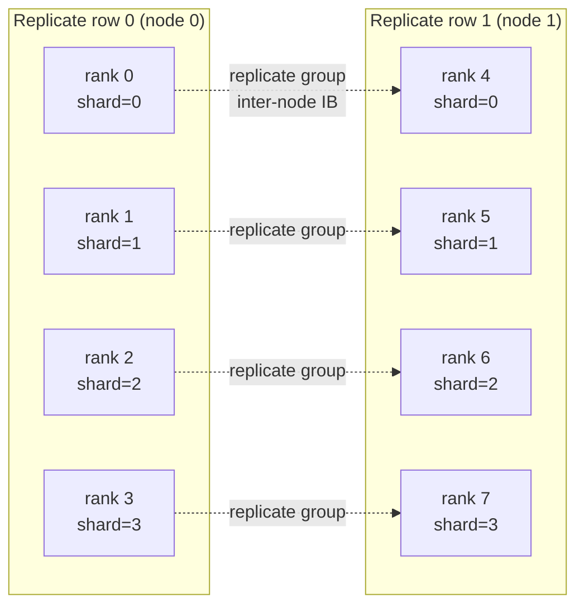

# HSDP Training (Multi-Node)

DMuon has **native HSDP support**: you bring a 2D device mesh with `(replicate, shard)` dimensions, pass both to `dedicate_params`, and DMuon handles the cross-replica reduce + broadcast on top of the in-replica shard collectives. Optional async mode hides the post-step broadcast inside the next iteration's forward pass.

This page walks through the HSDP API, explains what happens under the hood, and shows when to pick sync vs async mode.

!!! info "When to use HSDP"
    HSDP pays off once you train across **more than one node** (typically `replicate_size ≥ 2` with each replicate row on a different machine). For single-node multi-GPU, a 1D shard-only mesh is simpler and equally fast.

---

## TL;DR — 5-Line HSDP Integration

```python
import dmuon
from torch.distributed.device_mesh import init_device_mesh
from torch.distributed.fsdp import fully_shard

hsdp = init_device_mesh(
    "cuda", (replicate_size, shard_size),
    mesh_dim_names=("replicate", "shard"),
)

dmuon.dedicate_params(
    model, hsdp["shard"],
    predicate=lambda n, p: "proj" in n and p.ndim == 2,
    replicate_mesh=hsdp["replicate"],      # ← the HSDP knob
)

for layer in model.layers:
    fully_shard(layer, mesh=hsdp)          # ← FSDP2 uses the 2D mesh
fully_shard(model, mesh=hsdp)

optimizer = dmuon.Muon(
    model, lr=0.02, momentum=0.95,
    replicate_async=True,                  # default; async broadcast hiding
)
```

That's the entire API change from 1D shard-only. The rest of the training loop is unchanged.

---

## Quick Reference

| Knob | Where | Meaning |
|---|---|---|
| `mesh` arg to `dedicate_params` | `dmuon.dedicate_params(model, mesh, ...)` | 1D shard mesh (the column you broadcast across) |
| `replicate_mesh` kwarg | `dmuon.dedicate_params(..., replicate_mesh=...)` | 1D replicate mesh — when present, HSDP is on |
| `mesh` arg to `fully_shard` | `fully_shard(layer, mesh=hsdp)` | FSDP2's HSDP is driven by the full 2D mesh |
| `replicate_async` kwarg to `Muon` | `dmuon.Muon(..., replicate_async=True)` | `True` (default) hides post-step broadcast in next forward; `False` is the synchronous Phase B variant, bit-identical |

---

## What the 2D Mesh Means

In HSDP you have two axes:

- **`shard`**: parameters are split across ranks along this axis within each replicate row (FSDP-ZeRO2/3 behaviour)
- **`replicate`**: the shard layout is **replicated** across this axis — each replicate row is an independent full-model instance



```text
Example: init_device_mesh("cuda", (2, 4), mesh_dim_names=("replicate", "shard"))

             shard=0   shard=1   shard=2   shard=3
replicate=0  rank 0    rank 1    rank 2    rank 3     ← shard_group A  (NVLink within node)
replicate=1  rank 4    rank 5    rank 6    rank 7     ← shard_group B  (NVLink within node)
             └─ replicate_group for shard=0 ─┐
                 (inter-node IB link)        │
                 {rank 0, rank 4}            │
```

Each rank belongs to exactly one `shard_group` (size = `shard_size`) and one `replicate_group` (size = `replicate_size`). DMuon uses both: shard collectives carry per-layer broadcast/reduce; replicate collectives carry the post-step param-sync.

!!! tip "`mesh_dim_names` are important"
    DMuon reads the `"shard"` and `"replicate"` dim names from the mesh when composing with FSDP2's 2D checkpoint code path. Use these exact names.

---

## What Happens Under the Hood

Every Muon-target parameter has a **single global owner** — the rank with coordinates `(owner_shard, owner_replicate)`. That single rank holds the authoritative `_owned_data` + momentum buffer + runs Newton-Schulz.

Per training iteration:

1. **Forward**: each layer's `_pre_forward` hook waits any pending async replicate broadcast, then triggers the shard-group broadcast from the owner's shard column (one NCCL call per packed owner buffer).
2. **Backward**: a two-stage reduce sends grads to the global owner — `AVG` across the shard axis first, then `AVG` across the replicate axis. The net divisor is `G·R`, matching a single all-reduce over the whole world. Non-owner ranks free their grad.
3. **`optimizer.step()`**: only the global owner runs NS + momentum + weight-decay + update, on its local `_owned_data`.
4. **Post-step broadcast**: the updated `_owned_data` fans out to the other ranks in the owner's shard column via `replicate_group`. With `replicate_async=True` (default), this dispatch happens on a dedicated stream and the wait is consumed by the next iteration's first `_pre_forward` hook — so the broadcast hides inside forward compute.

The whole sequence is bit-identical whether you set `replicate_async=True` or `False`; async just moves the wait later.

---

## Sync vs Async Mode

| Mode | `replicate_async` | When to use | Risk |
|---|---|---|---|
| **Sync (Phase B)** | `False` | Debugging, checkpoint inspection, any time you want deterministic timing | None — always correct |
| **Async (Phase C, default)** | `True` | Production training, large models, multi-node | If replicate bandwidth is much slower than forward compute the broadcast cannot hide; a fallback protocol auto-degrades to sync after 3 consecutive slow waits (see below) |

### The Fallback Protocol

If `DMUON_REPLICATE_PROFILE=1` is set, DMuon measures the blocked-wait time at each `_pre_forward_wait` and auto-degrades a group to sync after **3 consecutive waits > 100 μs**. Once tripped, the flag is single-direction; reset via:

```python
dmuon.reset_replicate_fallback(model)
```

Tune the thresholds from Python if needed:

```python
import dmuon._backends.fsdp2.group as g
g.REPLICATE_WAIT_THRESHOLD_US = 250.0      # default 100.0
g.REPLICATE_FALLBACK_CONSECUTIVE_STEPS = 5 # default 3
```

---

## Profile the Broadcast

Turn on the per-group profile once you are sanity-checking a new cluster or model:

```bash
DMUON_REPLICATE_PROFILE=1 torchrun --nproc_per_node=4 train.py
```

In the training loop, call the report from rank 0:

```python
import dmuon
# ... training ...
dmuon.replicate_profile_report()   # rank-0 only; no-op elsewhere
```

Sample output:

```
==============================================================================
[DMUON_REPLICATE_PROFILE] per-group wait time summary (μs)
==============================================================================
                         group     n      mean       p50       p90       p99       max
                layers.0.mlp    100     14.22     13.80     18.40     22.30     25.10
                layers.1.mlp    100     18.70     17.90     24.10     28.40     31.80
                ...
```

`p90 < 100 μs` across groups typically means async is hiding well. If `p99` is wide, look at (a) replicate bandwidth (IB saturation), (b) forward compute time — async hiding needs *some* compute to hide behind.

---

## Correctness Guarantees

DMuon's HSDP paths are validated against the 1D shard-only path:

- **Bit-identical loss trajectory** over 10 steps on 4 GPUs (G=2, R=2) vs shard-only DMuon
- **Bit-identical restart** from a mid-training checkpoint
- **Bit-identical sync vs async** — the async event path produces exactly the same optimizer state as the sync path

The test files — `tests/distributed/test_hsdp_correctness.py`, `test_hsdp_async_correctness.py`, `test_hsdp_restart.py` — are in the repo and runnable with `torchrun --nproc_per_node=4`.

---

## Checkpointing under HSDP

State-dict save/load works identically to the 1D path — [`get_model_state_dict`](../reference/api.md) / [`set_model_state_dict`](../reference/api.md) detect the 2D mesh automatically and route the FSDP2 all-gather through the correct shard-axis subgroup. Any pending async replicate broadcast is drained before the state dict is read:

```python
# Save
model_sd = dmuon.get_model_state_dict(model)         # drains async broadcast first
optim_sd = dmuon.get_optimizer_state_dict(model, optimizer)
if dist.get_rank() == 0:
    torch.save({"model": model_sd, "optim": optim_sd}, "ckpt.pt")

# Restore (same HSDP topology)
ckpt = torch.load("ckpt.pt", map_location=device, weights_only=False)
dmuon.set_model_state_dict(model, ckpt["model"])
dmuon.set_optimizer_state_dict(model, optimizer, ckpt["optim"])
```

!!! warning "Cross-topology restore"
    DMuon's HSDP checkpoint format currently assumes you resume with the same `(shard_size, replicate_size)`. Changing topology on resume is not supported yet — convert offline via `get_model_state_dict` → single-process save → re-init + `set_model_state_dict` on the new topology.

---

## DMuon-Z2 vs DMuon-Z3 (packed-buffer lifecycle)

DMuon exposes the same memory-vs-comm tradeoff FSDP2 does, via its own `reshard_after_forward` kwarg on `dedicate_params()`. This controls whether the **Muon-target packed buffer** stays resident between forward and backward or is resharded (same idea as FSDP2's flag for non-Muon params, but applied to DMuon's own buffers).

| Mode | `reshard_after_forward` | Behaviour | Muon-target bytes/step | Muon-target memory |
|---|---|---|---|---|
| **DMuon-Z2** | `False` | packed buf resident through fwd+bwd; backward reuses it | `2(N-1)/N · P_M` (comm-optimal) | P_M resident per shard rank |
| **DMuon-Z3** | `True` (default) | packed buf freed after fwd; backward re-broadcasts from owner | `3(N-1)/N · P_M` | one layer's packed buf transient per rank |

```python
# DMuon-Z3 (default) — recommended for large models (7B+), matches FSDP2 ZeRO-3 memory model
dmuon.dedicate_params(
    model, hsdp["shard"],
    predicate=lambda n, p: "proj" in n and p.ndim == 2,
    replicate_mesh=hsdp["replicate"],
)

# DMuon-Z2 — opt-in for small/medium models where comm dominates and packed bufs fit
dmuon.dedicate_params(
    model, hsdp["shard"],
    predicate=lambda n, p: "proj" in n and p.ndim == 2,
    replicate_mesh=hsdp["replicate"],
    reshard_after_forward=False,                # ← DMuon-Z2 mode
)
```

**Rule of thumb**: match DMuon's `reshard_after_forward` to FSDP2's `fully_shard(..., reshard_after_forward=...)` for consistent memory model across Muon and non-Muon params:

```python
# Fully ZeRO-3 (default, large models)
dmuon.dedicate_params(model, hsdp["shard"], ..., replicate_mesh=hsdp["replicate"])
for layer in model.layers:
    fully_shard(layer, mesh=hsdp)                 # FSDP2 default = Z3

# Fully ZeRO-2 (comm-optimal, small/medium models)
dmuon.dedicate_params(model, hsdp["shard"], ..., replicate_mesh=hsdp["replicate"],
                      reshard_after_forward=False)                             # DMuon-Z2
for layer in model.layers:
    fully_shard(layer, mesh=hsdp, reshard_after_forward=False)                 # FSDP2 Z2
```

Asymmetric combinations (DMuon-Z2 + FSDP2-Z3, or vice versa) are valid and occasionally optimal (e.g. Muon params are few but large → DMuon-Z2; non-Muon params are many and small → FSDP2-Z3), but add mental overhead. Start with the symmetric config.

---

## Troubleshooting

**`RuntimeError: Guessing device ID based on global rank`**
: Cosmetic warning from recent PyTorch. Pass `device_id=torch.device("cuda", local_rank)` to `dist.init_process_group` to silence.

**Loss diverges after N steps of async but sync is fine**
: Extremely unlikely given the bit-identical tests, but if it happens, rerun with `replicate_async=False` to confirm, and open an issue with the NSight profile attached.

**OOM on owner ranks under HSDP**
: LPT partitioning balances owner load across **shard ranks**, but a rank still holds the full param + grad + state for each of its owned params. Tune `SMALL_PARAM_THRESHOLD` in `dmuon.partition` or increase `shard_size`.

**IB seems saturated during `optimizer.step` window**
: Check `DMUON_REPLICATE_PROFILE=1` output. If `p90 > 100 μs` and fallback keeps tripping, either widen the threshold (tune `REPLICATE_WAIT_THRESHOLD_US`) or accept sync mode.

---

## See also

- [Core Concepts](../getting-started/concepts.md) — how dedicated ownership composes with FSDP2
- [Training Guide](training.md) — the full 1D-shard workflow (apply this first, then add the HSDP knobs above)
- [Checkpointing](checkpoint.md) — state-dict semantics
- [Custom Hook Boundaries](custom-hook-boundaries.md) — align DMuon hook boundaries with your model structure
- [Z2 vs Z3 Modes](z2-z3-modes.md) — packed-buffer lifecycle and memory/comm tradeoff
- [Profiling & Fallback](profiling-and-fallback.md) — detailed broadcast profiling and fallback tuning
- [Integration Recipes](integration-recipes.md) — HuggingFace Trainer, torchtitan, and other framework hooks
- [API Reference](../reference/api.md) — full `dedicate_params` and `Muon` signatures
