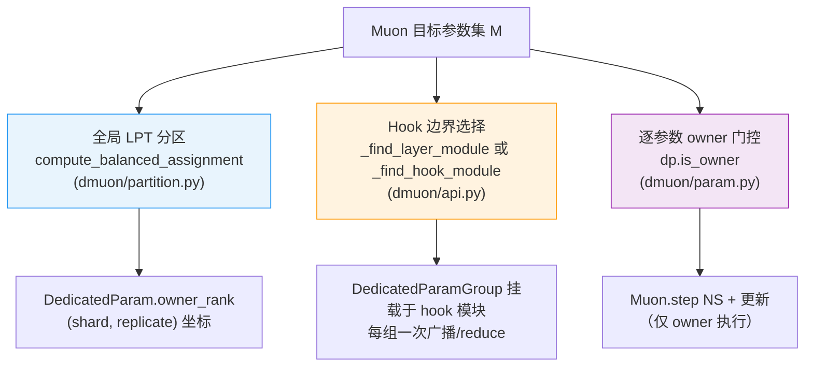
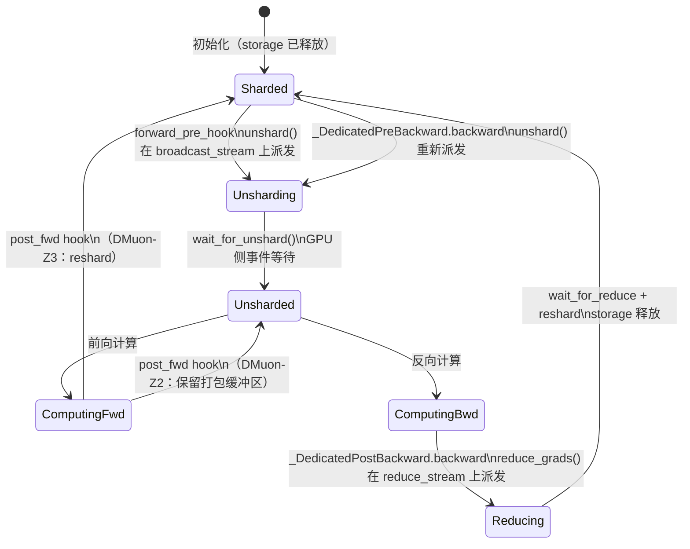
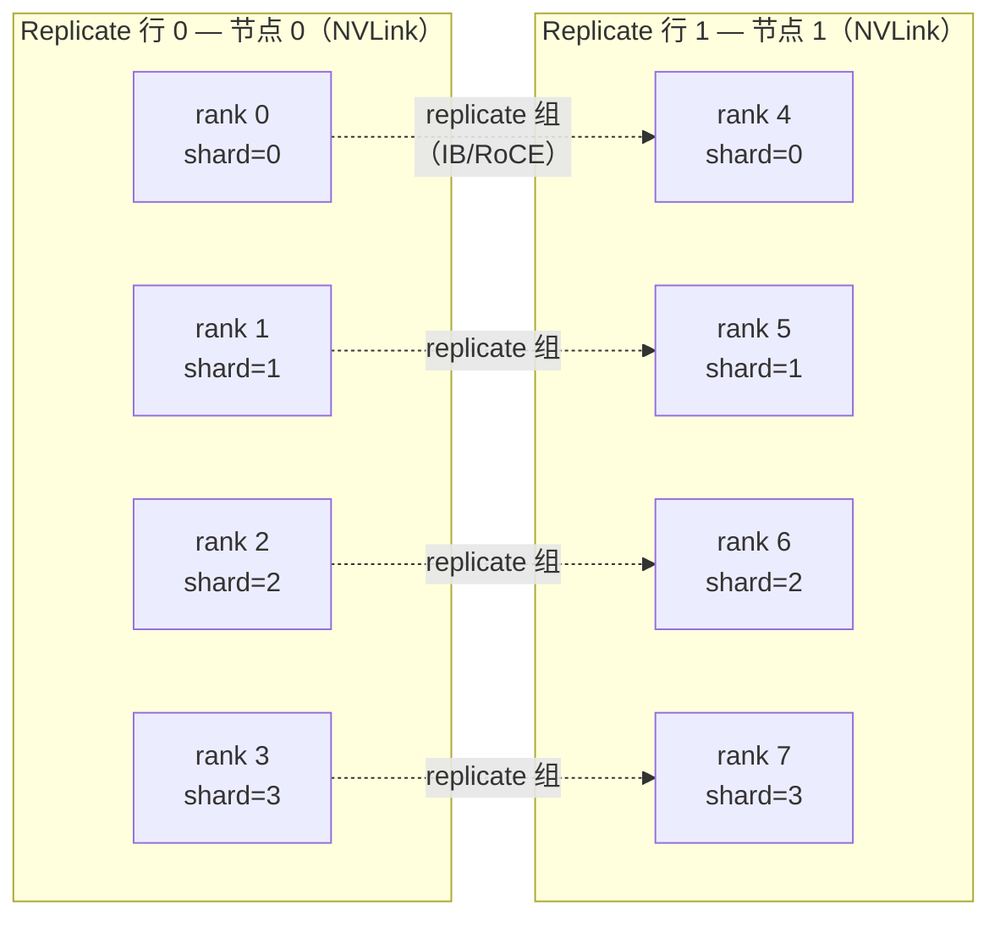
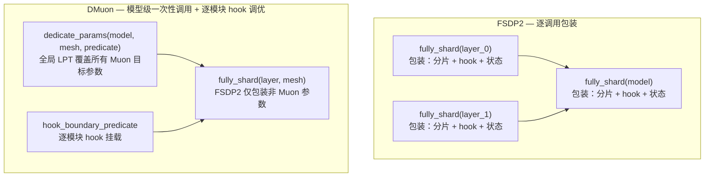

# 架构设计

!!! tip "核心要点"
    DMuon 将三个正交关注点分离：**全局分区（LPT）**、**逐模块 Hook 边界**、**逐参数归属步进**。这种解耦是 DMuon 区别于 FSDP2 以及其他基于归属权的工作的核心设计选择。理解这一点是阅读代码库的关键。

---

## 1. 矩阵优化器的原子性约束

矩阵优化器——Muon（[Kosson 等，2024](https://arxiv.org/abs/2409.12191)；[Jordan 等，2024](https://arxiv.org/abs/2409.20325)）、Shampoo（[Gupta 等，2018](https://arxiv.org/abs/1802.09568)）、SOAP（[Vyas 等，2024](https://arxiv.org/abs/2409.11321)）——在优化器步进时需要**完整的梯度矩阵** $G \in \mathbb{R}^{m \times n}$。以 Muon 为例，Newton-Schulz 正交化迭代如下：

$$X_{t+1} = \alpha X_t + \beta X_t X_t^\top X_t + \gamma X_t (X_t^\top X_t)^2$$

每次迭代都需要将完整矩阵与其转置相乘。$G$ 的行分片或列分片在数学上是不够的——运行 NS 之前必须通过 all-gather 重建完整矩阵。

**标准 FSDP2** 将每个参数均匀分片到各 rank（ZeRO-2 或 ZeRO-3）。在 ZeRO-3 下，每个 rank 只持有每个参数及其梯度的 $1/R$。对于矩阵优化器，这造成了两难局面：

- **向每个 rank 发起梯度的 all-gather**：每步额外通信量为 $O(P_M)$，$P_M$ 为 Muon 目标参数的总大小。
- **每个 rank 在 all-gather 后冗余执行 NS**：$R$ 倍冗余计算，内存不减。

两者在规模化训练中都无法接受。DMuon 通过专属归属权（dedicated ownership）彻底消除两者。

---

## 2. 专属归属权——原语

在 DMuon 中，**每个 Muon 目标参数的完整生命周期归属于唯一一个 rank**：

- **初始化**：归属 rank（owner）分配 `_owned_data`（权威的全精度副本）；其他 rank 持有轻量的占位符 `Parameter` 对象。
- **前向传播**：owner 通过单次 NCCL 调用（借助 `dist._coalescing_manager` 合并）将 `_owned_data` 广播给同分片组的所有 rank。
- **反向传播**：每个 rank 各自累积局部梯度，再通过 `dist.reduce` 将均值梯度发送给 owner。
- **优化器步进**：仅 owner 在本地内存上运行 Newton-Schulz + 动量 + 权重衰减 + 参数更新，无需任何通信。
- **步进后广播**（HSDP）：owner 通过跨节点 replicate 组将更新后的 `_owned_data` 广播给同分片列的其他 rank。

owner 永远不需要 all-gather；完整梯度通过 `reduce` 直达 owner。无额外通信；无冗余 NS。

### 技术溯源

专属归属权原语并非 DMuon 的发明，DMuon 将其规范化并扩展到 PyTorch DP 族：

- [**Rajbhandari 等，2020 (ZeRO-1)**](https://arxiv.org/abs/1910.02054) — 参数分片归属的优化器状态分片，建立了优化器状态所有权模型。
- [**Shi 等，2023（分布式 Shampoo）**](https://arxiv.org/abs/2309.06497) — 将类似归属结构应用于 Shampoo 的预处理矩阵。
- [**Wang 等，2026（Canzona）**](https://arxiv.org/abs/2602.06079) — 并行扩展该原语至 Megatron-LM 的 TP + ZeRO-1 场景的同期工作。
- **DMuon 2026** — 将该原语应用于 PyTorch FSDP2 / HSDP，配合全局 LPT 分区、Hook 边界解耦以及异步前向隐藏广播。

DMuon 不主张发明此原语。其贡献在于下面描述的三向解耦，以及将跨节点广播延迟隐藏于前向计算的 HSDP 原生调度。

---

## 3. 三向解耦（核心设计贡献）

标准 FSDP2 将三个决策合并为一：`fully_shard(module)` 同时确定**分片粒度**、**Hook 挂载边界**和**优化器分区**——它们重合是因为均匀的逐张量分片使三者等价。DMuon 的 LPT 分区打破了这种等价性，三个维度**必须**分离：

### 3.1 分区（全局 LPT）

`dmuon/partition.py` 中的 `compute_balanced_assignment` 一次性对**所有** Muon 目标参数运行**最长处理时间优先（LPT）**贪心分配。LPT 是 NP-难装箱问题的启发式算法，对同质元素可保证至多 $\frac{4}{3} - \frac{1}{3R}$ 的最优不平衡率。

算法内置的关键约束：

1. **同层并发**：同一 Transformer 层的参数分配到不同 owner slot，使各 owner 的分片维度广播可以并发（每 owner 一次 NCCL），而非全部序列化到 rank 0。
2. **小参数合并**：同层中小于 `SMALL_PARAM_THRESHOLD`（默认 500 万元素）的参数合并为一个分配单元，共享同一 owner，统一打包广播。
3. **HSDP 下的 2D Slot**：提供 `replicate_mesh` 时，LPT 在完整 2D 网格的全部 `G·R` slot 上运行，同时在分片和复制两个维度分配工作。

**为何必须全局？** 逐模块 LPT 仅有局部信息。以 R=8、每层 7 个投影矩阵为例，逐层 LPT 最多分配 7 个不同 rank，使 rank 7 在每层均闲置（浪费 12.5% 容量）。全局视图允许调度器为碰巧是最轻 slot 的层大量分配给 rank 7。

### 3.2 Hook 边界（逐模块）

**Hook 边界**决定哪个模块注册触发广播和 reduce 的前/后向 Hook，控制广播合并的粒度。

两种模式：

- **默认启发式**（`hook_boundary_predicate=None`）：`_find_layer_module` 从每个参数的 FQN 中提取 `layers.N` 或 `blocks.N` 祖先模块。`layers.3` 内的所有专属参数共享一个 `DedicatedParamGroup` 和一对前向 Hook——其广播在一次 owner 的单次 NCCL 调用中合并。
- **显式谓词**（`hook_boundary_predicate=(module) -> bool`）：`_find_hook_module` 遍历每个专属参数的祖先，在谓词首次返回 True 的最低祖先上挂载 Hook。这与 FSDP2 的 `fully_shard(module, ...)` 模式对称，赋予用户同等级别的显式控制。

Hook 边界与分区**彼此独立**：rank 0 和 rank 3 分别拥有的两个参数可以位于同一 Hook 边界（同一 `DedicatedParamGroup`），在一次前向 pre-hook 调用中并发触发两个独立的广播。

### 3.3 Owner 步进（逐参数）

`reduce_grads` 完成后，`DedicatedParam.is_owner` 门控优化器步进：

```python
if dp.is_owner:
    # 仅在 dp._owned_data 上运行 Newton-Schulz + 动量 + 更新
```

在 HSDP 模式下，`is_owner` 同时编码分片和复制两个维度——只有单一全局 owner（shard=`owner_shard`，replicate=`owner_replicate`）执行更新。其他所有 rank 完全跳过 NS 计算。

### 示意图



三个维度**相互独立**：改变 Hook 边界不影响参数归属；改变分区不影响 Hook 挂载位置；改变优化器门控仅是运行时对 `is_owner` 的读取。

---

## 4. 生命周期——每步发生了什么

### 状态图



### 逐步说明

**步骤 n，前向传播：**

1. 第 `i` 层的 `_pre_forward` Hook 触发。首先调用 `_pre_forward_wait()` 消费步骤 `n-1` 遗留的异步 replicate 广播（仅 HSDP）。然后 `unshard()` 分配打包缓冲区 storage 并在 `broadcast_stream` 上派发 NCCL 广播（按 owner 合并）。同时，前向预取（forward prefetch）派发第 `i+1` 层的广播。
2. `wait_for_unshard()` 在当前流上设置 GPU 侧事件等待——计算内核队列阻塞直至广播完成。
3. 每个 rank 均使用完整参数执行前向计算。
4. `_post_forward` 触发：在 **DMuon-Z3** 模式下，`reshard()` 释放打包缓冲区 storage（对应 FSDP2 的 ZeRO-3）。在 **DMuon-Z2** 模式（`reshard_after_forward=False`）下，打包缓冲区保持驻留，消除反向重广播。

**步骤 n，反向传播：**

5. 注册于前向输出的 `_DedicatedPreBackward.backward` 触发，调用 `unshard()` + `wait_for_unshard()`——DMuon-Z2 下为空操作（缓冲区已存活）。同时将 autograd 引擎根回调入队作为兜底。
6. 反向计算执行；autograd 将梯度写入 `_unsharded_param.grad`（持久化 Parameter 对象——Phase 2 参数复用意味着无需梯度转移步骤）。
7. 注册于前向输入的 `_DedicatedPostBackward.backward` 触发：`reduce_grads()` 在 `reduce_stream` 上派发阶段一分片 reduce（按 owner 合并），在 `replicate_broadcast_stream` 上派发阶段二 replicate reduce（仅 HSDP）。`reshard()` 释放 storage。

**步骤 n，优化器：**

8. `Muon.step()` 遍历专属参数；`is_owner` 门控仅对全局 owner 运行 NS + 动量 + 更新。非 owner rank 跳过。
9. （HSDP）`replicate_broadcast_async()` 在 `replicate_broadcast_stream` 上派发将更新后的 `_owned_data` 广播给同分片列的 rank。事件存储于 `_replicate_broadcast_state`，由步骤 `n+1` 的 `_pre_forward_wait()` 消费。

---

## 5. HSDP 扩展

### 2D 网格布局



每个 rank 恰好属于一个 `shard_group`（大小 `G`）和一个 `replicate_group`（大小 `R`）。参数的全局 owner 占据网格中的一个单元 `(owner_shard, owner_replicate)`。同一分片列（`*`, `owner_shard`）中的所有其他单元均持有 `_owned_data` 的副本，供分片维度广播使用。

### 两阶段梯度 Reduce

HSDP 中的梯度平均是两个独立 reduce 的流水线：

1. **阶段一——分片 reduce**（`dist.reduce`，`ReduceOp.AVG`，在 `dp_group` 上）：对一个 replicate 行内的 `G` 个 rank 的梯度取均值，将分片均值结果发送到分片 owner rank。运行于 `reduce_stream`（高优先级，节点内 NVLink）。
2. **阶段二——replicate reduce**（`dist.reduce`，`ReduceOp.AVG`，在 `replicate_group` 上）：对 `R` 个 replicate 行的阶段一输出取均值，将全局均值梯度发送到全局 owner rank。运行于 `replicate_broadcast_stream`（默认优先级，跨节点 IB/RoCE）。

净除数为 `G·R`，等价于对全体 rank 的单次 all-reduce。两阶段流水线使用不同 stream，使不同层的阶段一和阶段二得以重叠。

### 跨步骤异步前向隐藏广播

`optimizer.step()` 后，全局 owner 持有新的 `_owned_data`，必须在下一次前向传播前同步给同分片列所有 `R-1` 个 rank。同步模式（`replicate_async=False`）下此等待会阻塞优化器窗口。异步模式（`replicate_async=True`，默认）将派发和等待解耦：

- **派发**（`replicate_broadcast_async`）：在 `optimizer.step()` 完成后立即在 `replicate_broadcast_stream` 上触发 NCCL 广播，记录持有事件和张量引用的 `ReplicateBroadcastState`。立即返回。
- **等待**（`_pre_forward_wait`）：由**下一轮迭代**的 `_pre_forward` Hook 在 `unshard()` 读取 `_owned_data` 前消费。若 IB 传输在前序层前向计算期间已完成，此等待实际耗时接近零。

Fallback 协议在连续 3 次（可调）等待超过 100 µs 后自动降级为同步模式，在 IB 带宽不足时保护正确性。阈值通过 `REPLICATE_WAIT_THRESHOLD_US` 和 `REPLICATE_FALLBACK_CONSECUTIVE_STEPS` 调节。

### 优先级分配

分片维度的集合通信（`broadcast_stream`、`reduce_stream`）使用 CUDA stream 优先级 `-1`（高）。Replicate 维度的集合通信（`replicate_broadcast_stream`）使用默认优先级。这与 FSDP2 的惯例一致：节点内 all-gather/reduce-scatter 使用高优先级，跨节点 all-reduce 使用默认优先级——避免 IB 侧流量饥饿 NVLink。

---

## 6. 与 FSDP2 的组合

### Monkey-Patch 机制

执行 `import dmuon` 时，`patch.install_patch()` 包装 FSDP2 初始化路径中的 `_get_managed_states`。被补丁的版本在委托给原始函数前，将所有携带 `_dedicated_owner_rank` 的参数加入 `ignored_params`：

```python
def _patched_get_managed_states(modules, ignored_params=None):
    if ignored_params is None:
        ignored_params = set()
    for module in modules:
        for _, param in module.named_parameters(recurse=False):
            if hasattr(param, "_dedicated_owner_rank"):
                ignored_params.add(param)
    return _original_fn(modules, ignored_params)
```

这意味着后续的 `fully_shard()` 调用会静默跳过专属参数。无需修改 FSDP2 内部实现——补丁仅触及单个私有函数，并可通过 `dmuon.patch.uninstall_patch()` 完全还原。

### 为何不是适配器

DMuon 并非作为适配层叠加在 FSDP2 之上。两个系统管理**不相交的参数集**，运行于**不相交的 stream**：

- FSDP2 管理非 Muon 参数：在 `all_gather_stream`（高优先级）上 all-gather，在 `reduce_scatter_stream`（高优先级）上 reduce-scatter。
- DMuon 管理 Muon 目标参数：在 `broadcast_stream`（高优先级）上广播，在 `reduce_stream`（高优先级）上 reduce，在 `replicate_broadcast_stream`（默认优先级）上做 replicate 广播。

两个系统在相同模块对象上注册 Hook，但注册顺序有意为之：DMuon 使用 `register_forward_pre_hook(..., prepend=False)`（追加在 FSDP2 的 `prepend=True` Hook 之后），确保 FSDP2 的 pre-hook 先触发。两个系统之间无共享状态、无继承关系、无 API 包装。

### 三个 Stream 与 FSDP2 惯例对齐

| Stream | 优先级 | 用途 |
|---|---|---|
| `broadcast_stream` | 高（-1） | 分片维度参数广播（节点内 NVLink） |
| `reduce_stream` | 高（-1） | 分片维度梯度 reduce（节点内 NVLink） |
| `replicate_broadcast_stream` | 默认 | Replicate 维度步后广播（跨节点 IB/RoCE） |

FSDP2 采用同样惯例：`all_gather_stream` / `reduce_scatter_stream`（节点内）高优先级，`all_reduce_stream`（跨节点 replicate）默认优先级。对齐优先级确保两个系统不竞争同一 CUDA stream 资源。

---

## 7. 与 FSDP2 组合式 API 的对比

### FSDP2 的逐调用粒度



### 差异的根本原因

FSDP2 的 `fully_shard(module)` 每模块调用一次，独立定义该模块的分片。之所以可行，是因为均匀的逐张量分片是尴尬并行（embarrassingly parallel）的——每个模块的分片决策是局部最优的。

DMuon 的 LPT 无法做出局部决策。逐模块 LPT 只能看到该模块内的参数——例如 8 个投影矩阵——将它们分配给 8 个 rank。但若 R=8 且每层 7 个参数，rank 7 在每层均闲置（12.5% 闲置）。全局 LPT 同时看到所有层，可以将 rank 7 大量分配给它恰好是最轻 slot 的那些层。

因此，`dedicate_params(model, mesh, predicate)` 对**整个模型**调用**一次**，`hook_boundary_predicate` 是分区固定后调整逐模块 Hook 粒度的独立旋钮。这是相对于 FSDP2 API 的一次有意识的设计反转。

---

## 8. 正确性不变式

以下不变式在每个训练步骤中均需维持，并在 `tests/distributed/test_hsdp_correctness.py` 和 `test_hsdp_async_correctness.py` 中进行测试：

**I1 — 单一全局 owner：**
`dp.is_owner == True` 当且仅当该 rank 的 `(shard_rank, replicate_rank)` 坐标均与 `dp.owner_rank` 匹配。1D 模式下 `replicate_rank` 固定为 0，条件退化为 `shard_rank == owner_shard`。

**I2 — 分片列 `_owned_data` 存在性：**
`dp._owned_data is not None` 在 owner 所在分片列的**每个** rank 上成立（即所有 replicate 索引 `r` 对应 `owner_shard` 的 rank）。这是必要的，因为分片维度广播的发送方是当前 replicate 行中与 `owner_shard` 匹配的 rank——该 rank 必须有有效的 `_owned_data` 来填充打包缓冲区。全局 owner 持有权威副本；分片列的 peer rank 通过步后 replicate 广播接收。

**I3 — 独占梯度所有权：**
`wait_for_reduce()` 完成后，只有**全局 owner** 具有有效的 `_reduced_grad`，非 owner rank 的 `_reduced_grad` 为 `None`。优化器步进在 `is_owner` 门控下读取 `_reduced_grad`——非 owner rank 的意外读取会立即引发 `AttributeError` 或返回 `None`，是即时的正确性信号。

**I4 — Replicate Peer 一致性：**
`replicate_broadcast_sync()` 完成后，或异步 `ReplicateBroadcastState` 被 `_pre_forward_wait()` 消费后，owner 所在分片列的所有 rank 具有相同内容的 `_owned_data`。下一次分片维度广播因此向两个 replicate 行的所有非 owner rank 发送相同的权重。

### 测试套件

```
tests/distributed/test_hsdp_correctness.py
    — 逐比特相同的损失轨迹（同步 vs 异步，10 步，G=2 R=2）
tests/distributed/test_hsdp_async_correctness.py
    — 异步 replicate 广播与同步路径产生相同优化器状态
```

运行方式：
```bash
torchrun --nproc_per_node=4 tests/distributed/test_hsdp_correctness.py
torchrun --nproc_per_node=4 tests/distributed/test_hsdp_async_correctness.py
```

---

## 参见

- [核心概念](../getting-started/concepts.md) — 面向新用户的所有权模型介绍
- [快速开始](../getting-started/quickstart.md) — 5 分钟上手
- [HSDP 指南](../guides/hsdp.md) — 完整 HSDP API 参考与调优
- [自定义 Hook 边界](../guides/custom-hook-boundaries.md) — `hook_boundary_predicate` 实践
- [Z2 与 Z3 模式](../guides/z2-z3-modes.md) — 打包缓冲区生命周期与内存/通信权衡
- [性能分析与 Fallback](../guides/profiling-and-fallback.md) — replicate 广播分析与 fallback 调优
- [API 文档](../reference/api.md) — `dedicate_params` 和 `Muon` 完整签名
- [通信成本分析](../reference/communication-cost.md) — 每次集合通信的逐字节分析
