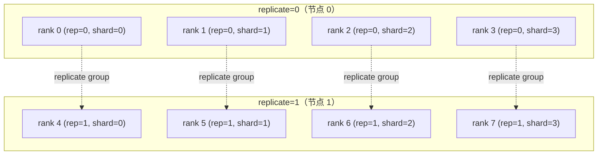
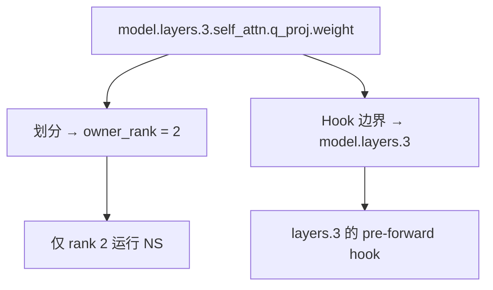

# 核心概念

!!! tip "TL;DR"
    DMuon 有三个核心概念：**专属所有权**（每个矩阵参数由一个 rank 独占并
    独立运行 Newton-Schulz）、**DMuon-Z2/Z3 模式**（打包缓冲区生命周期，
    镜像 FSDP2 的 `reshard_after_forward`）、**Hook 边界**（Hook
    挂载位置，与参数划分相互独立）。

---

## 1. 专属所有权

### 它解决的问题

矩阵优化器（如 [Muon](https://arxiv.org/abs/2502.16982)）需要**完整的梯度矩阵**
才能计算 Newton-Schulz 正交化：

$$
X_{k+1} = a_k X_k + b_k (X_k X_k^\top) X_k + c_k (X_k X_k^\top)^2 X_k
$$

FSDP2 的 reduce-scatter 后每个 rank 只持有 1/R 的梯度。要运行 Newton-Schulz，
必须 all-gather（O(mn) 额外通信）或每个 rank 各自运行 NS（R 倍冗余计算）。
8 张 GPU 上的 8B 模型，仅此两项就带来 3–4 倍 AdamW 开销。

### 工作原理

每个 Muon 目标参数分配给唯一的**所有者 rank**，所有者存储完整参数；其他
rank 持有空占位符。每步执行顺序：

1. **前向广播** — 所有者向 shard peers 发送完整参数
2. **前向回收** — 非所有者在层前向完成后丢弃参数
3. **反向广播** — 所有者再次广播用于梯度计算
4. **反向 reduce** — 梯度取平均后仅发送给所有者
5. **所有者 NS 更新** — 所有者运行 Newton-Schulz，无需额外通信
6. **AdamW 更新 FSDP2 分片** — 所有 rank 更新非专属参数

```
          标准 FSDP2                     DMuon
          ==============                 =====
          R0    R1    R2    R3
q_proj:   [1/4] [1/4] [1/4] [1/4]  →   R0 拥有完整 q_proj
k_proj:   [1/4] [1/4] [1/4] [1/4]  →   R0 拥有完整 k_proj
v_proj:   [1/4] [1/4] [1/4] [1/4]  →   R1 拥有完整 v_proj
gate:     [1/4] [1/4] [1/4] [1/4]  →   R2 拥有完整 gate_proj
down:     [1/4] [1/4] [1/4] [1/4]  →   R3 拥有完整 down_proj
ln:       [1/4] [1/4] [1/4] [1/4]      [1/4] [1/4] [1/4] [1/4]
```

### 历史渊源

专属所有权可追溯至 **ZeRO-1**（Rajbhandari 等，2020），其将优化器状态
按 rank 分区。**Distributed Shampoo**（Shi 等，2023）将单所有者模式用于
Kronecker 分解因子，证明了基于所有权分配无需 all-gather 梯度即可完成
全矩阵运算。DMuon 将此原语扩展至 Muon 的 Newton-Schulz，并与 FSDP2 的
模块级分片原生结合。

### 均衡划分

`dedicate_params()` 使用带约束的 **LPT（最长处理时间）**算法：全局均衡
（每 rank 约 `总参数量 / R` 元素）和层内并发（同层参数分散到不同 rank，
实现并发广播）。HSDP 模式下在全部 `G × R` 个所有者槽上均衡。

---

## 2. HSDP 与二维 Mesh

HSDP 使用二维 `(replicate, shard)` 设备 Mesh。每个 Muon 目标参数有唯一
的**全局所有者**，坐标为 `(owner_shard, owner_replicate)`。



每轮迭代：shard-group 广播 → 两阶段 reduce（AVG shard，AVG replicate，
净除数 G·R）→ 所有者 NS → 步后 replicate 广播。
`replicate_async=True`（默认）将 replicate 广播隐藏在下一轮前向计算中。

---

## 3. DMuon-Z2 与 DMuon-Z3

| 模式 | `reshard_after_forward` | 打包缓冲区行为 | 每步字节数 | 内存 |
|------|------------------------|--------------|-----------|------|
| **DMuon-Z3** | `True`（默认） | 前向后释放；反向重新广播 | `3(N-1)/N · P_M` | 每层瞬态 |
| **DMuon-Z2** | `False` | 前向+反向全程驻留 | `2(N-1)/N · P_M` | 每 shard rank 驻留 `P_M` |

将 DMuon 与 FSDP2 的标志保持一致以获得统一内存模型：

```python
# 全 ZeRO-3（大模型，默认）
dmuon.dedicate_params(model, mesh, predicate=..., reshard_after_forward=True)
for layer in model.layers:
    fully_shard(layer, mesh=mesh)

# 全 ZeRO-2（通信最优，中小型模型）
dmuon.dedicate_params(model, mesh, predicate=..., reshard_after_forward=False)
for layer in model.layers:
    fully_shard(layer, mesh=mesh, reshard_after_forward=False)
```

决策树详见 [Z2 与 Z3 模式](../guides/z2-z3-modes.md)。

---

## 4. Hook 边界与参数划分

Hook 边界与参数划分是**相互独立的关注点**。

- **参数划分** — 全局 LPT；决定*哪个 rank* 拥有每个参数
- **Hook 边界** — 前向/反向 Hook 注册的模块；决定广播/reduce *何时* 触发，
  应与 `fully_shard()` 粒度匹配



**默认启发式**：`hook_boundary_predicate=None` 时，DMuon 扫描参数 FQN 中的
`layers.N` 或 `blocks.N` 模式——覆盖标准 Llama/GPT/BERT 命名，无需配置。

**自定义 Hook 边界**：对于 ViT、MoE 或自定义 Block，设置
`hook_boundary_predicate` 显式指定 Hook 模块。DMuon 在**满足谓词的最低祖先**
上注册 Hook。

```python
# ViT 使用 "blocks.N" 命名
dmuon.dedicate_params(
    model, mesh,
    predicate=lambda n, p: "proj" in n and p.ndim == 2,
    hook_boundary_predicate=lambda m: hasattr(m, "attn") and hasattr(m, "mlp"),
)
```

`hook_boundary_strict=True`（默认）在任何专属参数找不到匹配祖先时抛出异常，
防止悄无声息地退化为逐子模块 Hook。详见
[自定义 Hook 边界](../guides/custom-hook-boundaries.md)。

---

## 5. 与 FSDP2 和 TP 的组合

**FSDP2**：DMuon 与 FSDP2 在同一模型上管理不相交的参数集。`import dmuon`
时安装的 monkey-patch 使 `fully_shard()` 跳过 `_dedicated_owner_rank` 参数。
设置顺序：`import dmuon` → `dedicate_params` → `fully_shard`。

!!! warning "顺序至关重要"
    在 `dedicate_params()` 之前调用 `fully_shard()` 会导致 FSDP2 分片
    Muon 目标参数，DMuon 随后无法接管。

**张量并行**：DMuon 使用 **Gram Newton-Schulz**——在 (d, d) Gram 矩阵上迭代。
Gram 矩阵从 TP 分片重构只需一次 all-reduce：O(d²) 而非 O(mn)。
应用顺序：TP 最先，DMuon 其次，FSDP2 最后：

```python
parallelize_module(layer.mlp, tp_mesh, {...})    # 先 TP
dmuon.dedicate_params(model, dp_mesh, ...)       # 再 DMuon
fully_shard(layer, mesh=dp_mesh)                 # 最后 FSDP2
```

---

## 术语表

| 术语 | 定义 |
|------|------|
| **专属所有权** | 一个 rank 存储并更新完整参数，其他 rank 持有占位符 |
| **Muon 目标参数** | 被 `predicate` 选中进行专属所有权和 Newton-Schulz 更新的参数 |
| **所有者 rank** | 持有 `_owned_data`、累积梯度并运行 Newton-Schulz 的 rank |
| **Hook 边界** | DMuon 的前/后向 Hook 注册所在的模块 |
| **DMuon-Z2 / DMuon-Z3** | 打包缓冲区生命周期模式（`reshard_after_forward=False/True`） |
| **Newton-Schulz** | 计算正交极因子的迭代算法；Muon 用于权重更新 |
| **Replicate broadcast** | 步后从全局所有者扇出 `_owned_data` 到 replicate peers（仅 HSDP） |

---

## 另请参见

- [HSDP 指南](../guides/hsdp.md) — 二维 Mesh、异步模式、Fallback
- [自定义 Hook 边界](../guides/custom-hook-boundaries.md) — ViT、MoE、非标准架构
- [Z2 与 Z3 模式](../guides/z2-z3-modes.md) — 内存/通信权衡决策树
- [API 文档](../reference/api.md) — `dedicate_params` 和 `Muon` 的完整签名
