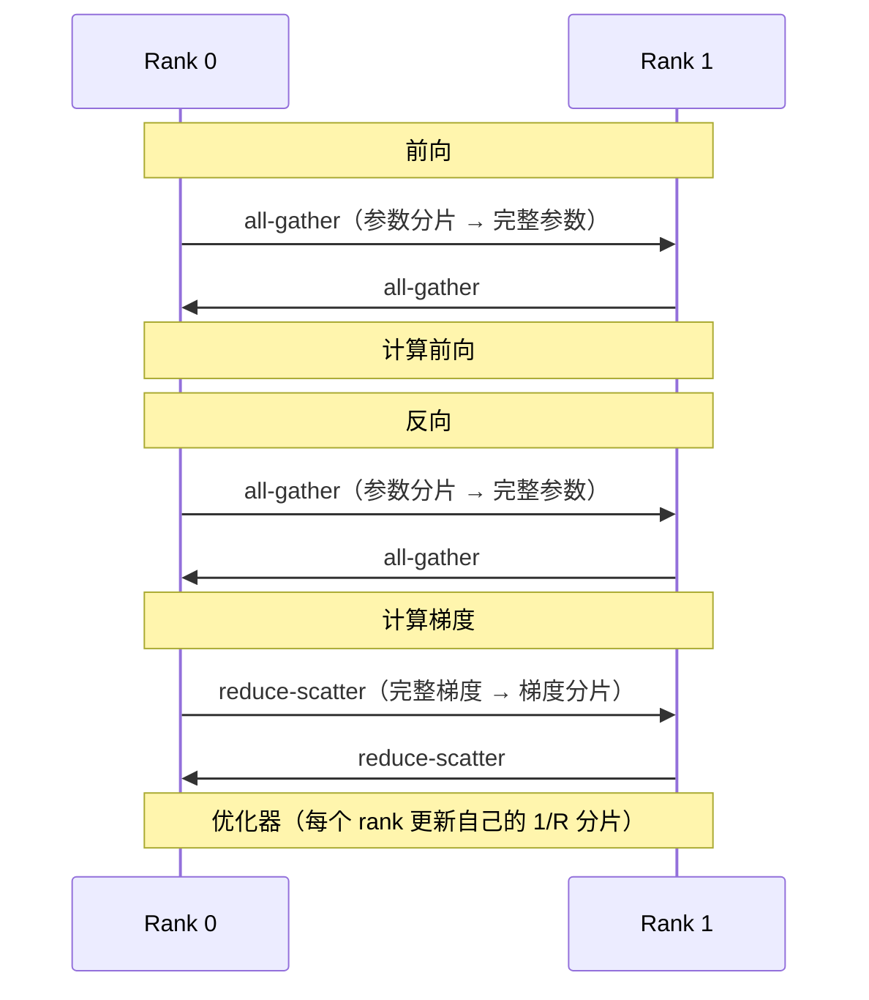
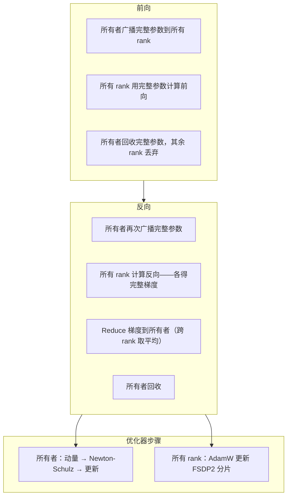

# 核心概念

本页构建你理解 DMuon 所需的心智模型。读一遍，后续文档都会变得清晰。

---

## FSDP2 回顾

PyTorch FSDP2（`fully_shard`）通过**分片**将模型分布到 R 个 rank：

- 每个 rank 存储每个参数的 **1/R**
- **前向**：all-gather 完整参数，计算后丢弃
- **反向**：再次 all-gather，计算梯度，然后 reduce-scatter 使每个 rank 得到 1/R 的梯度



这对逐元素优化器（如 **AdamW**）完美适用——每个 rank 使用自己的梯度分片独立更新自己的参数分片。

## 矩阵优化器的困境

矩阵优化器不是逐元素工作的。[Muon](https://arxiv.org/abs/2502.16982) 需要**完整的梯度矩阵**来计算 Newton-Schulz 正交投影：

$$
X_{k+1} = a_k X_k + b_k (X_k X_k^T) X_k + c_k (X_k X_k^T)^2 X_k
$$

FSDP2 的 reduce-scatter 后，每个 rank 只有 **1/R 的梯度**。要运行 Newton-Schulz，需要：

1. **All-gather** 完整梯度 — O(mn) 额外通信
2. **每个 rank 都运行 NS** — R 倍完全相同的计算，完全冗余

对于 8B 模型在 8 张 GPU 上，这个 all-gather + 冗余计算会给每步增加 **3-4 倍**开销。

## 专属所有权

DMuon 的核心洞察：**如果一个 rank 拥有完整梯度，只有那个 rank 需要运行 NS**。

DMuon 不使用 FSDP2 的对称分片（每个 rank 持有 1/R），而是为每个矩阵参数指定一个**所有者 rank**：

```
           标准 FSDP2                      DMuon
           ==============                  =====

           Rank 0  Rank 1  Rank 2  Rank 3
q_proj:    [1/4]   [1/4]   [1/4]   [1/4]     Rank 0 持有完整 q_proj
k_proj:    [1/4]   [1/4]   [1/4]   [1/4]     Rank 0 持有完整 k_proj
v_proj:    [1/4]   [1/4]   [1/4]   [1/4]     Rank 1 持有完整 v_proj
o_proj:    [1/4]   [1/4]   [1/4]   [1/4]     Rank 1 持有完整 o_proj
gate_proj: [1/4]   [1/4]   [1/4]   [1/4]     Rank 2 持有完整 gate_proj
up_proj:   [1/4]   [1/4]   [1/4]   [1/4]     Rank 2 持有完整 up_proj
down_proj: [1/4]   [1/4]   [1/4]   [1/4]     Rank 3 持有完整 down_proj
ln:        [1/4]   [1/4]   [1/4]   [1/4]     [1/4]  [1/4]  [1/4]  [1/4]
```

所有者存储**完整**参数。其他 rank 什么都不存（空占位符）。非矩阵参数（LayerNorm、embedding 等）保持 FSDP2 的正常分片。

## 两类参数

DMuon 将模型参数分成两个不相交的组：

### 专属参数（Dedicated Parameters）

- 由你提供的 `predicate` 选中（通常是 2D 投影层）
- 通过均衡分配算法分配给所有者 rank
- 通信方式：**broadcast**（前向）+ **reduce**（反向）
- 优化器：**Muon**（Newton-Schulz），仅所有者运行

### 对称参数（Symmetric Parameters）

- 所有未被 predicate 选中的参数（LayerNorm、embedding、bias 等）
- 由 FSDP2 标准分片管理（每个 rank 1/R）
- 通信方式：**all-gather** + **reduce-scatter**（标准 FSDP2）
- 优化器：**AdamW**，所有 rank 在各自分片上运行

!!! info "为什么叫「对称」和「专属」？"
    「对称」因为每个 rank 扮演相同角色——各持有相等的分片。「专属」因为一个 rank *专属*于持有完整参数——一个不对称的、专门化的角色。

## 数据流

一个训练步骤的完整数据流：



逐步解释：

1. **前向广播**：所有者将完整参数发送到所有 rank。每个 rank 用相同的完整矩阵计算前向。

2. **前向回收**：层的前向完成后，非所有者 rank 丢弃参数（类似 FSDP2 的 `FULL_SHARD`）。

3. **反向广播**：计算梯度需要完整参数，所有者再次广播。

4. **反向 reduce**：每个 rank 计算了一份梯度，这些梯度被 **reduce**（取平均）发送到所有者。所有者现在拥有完整的、平均后的梯度。

5. **所有者 NS 更新**：所有者对完整梯度运行动量累积和 Newton-Schulz 正交化。其他 rank 无需参与。

6. **AdamW 更新 FSDP2 参数**：同时，所有 rank 使用标准 AdamW 更新其 FSDP2 分片中的非矩阵参数。

!!! tip "通信开销"
    步骤 4 中的 reduce 是 O(mn/R)——每个 rank 向所有者发送梯度，NCCL 的 reduce 树意味着每个 rank 传输约 1/R 的数据。这比朴素 FSDP2+Muon 的 all-gather（O(mn)）**更便宜**。

## 均衡分配

`dedicate_params()` 不是随机分配所有者的。它使用 **LPT（最长处理时间）**算法，带有约束：

- **全局均衡**：每个 rank 大约拥有 `总参数量 / R` 个元素
- **层内并发**：同一层的参数分配到不同 rank，实现并发广播
- **小参数打包**：同一层的 k_proj + v_proj 可以共享一个所有者，进行打包广播

```python
# 示例：4 层，每层 7 个参数，4 个 rank
# LPT 按 numel 分配，最大的优先：
#   第 0 层：gate_proj→R0, up_proj→R1, down_proj→R2, q_proj→R3, ...
#   第 1 层：gate_proj→R1, up_proj→R2, down_proj→R3, q_proj→R0, ...
# 结果：每个 rank 拥有大致相同的总 numel
```

你可以查看分配结果：

```python
assignment = dmuon.dedicate_params(model, mesh, predicate=...)
# assignment: {param: owner_rank, ...}

# 查看当前 rank 拥有什么：
owned = dmuon.get_owned_params(model, rank=dist.get_rank())
for dp in owned:
    print(f"  {dp.param_name}: {dp._orig_size}")
```

## 与 FSDP2 组合

DMuon 在同一个模型上与 FSDP2 **并行运行**。设置顺序很重要：

```python
# 步骤 1：标记专属参数（在 fully_shard 之前）
dmuon.dedicate_params(model, mesh, predicate=...)

# 步骤 2：应用 FSDP2（专属参数自动跳过）
for layer in model.layers:
    fully_shard(layer, mesh=mesh)
fully_shard(model, mesh=mesh)
```

!!! warning "顺序很重要"
    `dedicate_params()` 必须在 `fully_shard()` **之前**调用。`import dmuon` 时的 monkey-patch 使 `fully_shard()` 自动跳过任何标记了 `_dedicated_owner_rank` 的参数。如果先 shard，FSDP2 会在 DMuon 介入前接管参数。

内部组合机制：

1. `dedicate_params()` 给参数标记 `_dedicated_owner_rank` 并在每个层模块上注册前向/反向 hook
2. Monkey-patch 使 `fully_shard()` 忽略已标记的参数——它们不会参与 FSDP2 的 all-gather/reduce-scatter
3. 训练时，DMuon 的 hook 处理专属参数的 broadcast/reduce，FSDP2 的 hook 处理对称参数的 all-gather/reduce-scatter——两者在同一个模块上，由相同的前向/反向调用触发

## TP 兼容性（概览）

使用张量并行（TP）时，所有者 rank 持有的是 **TP 分片**，不是完整参数。梯度也是分片的。标准 Newton-Schulz 需要完整矩阵——怎么办？

DMuon 使用 **Gram Newton-Schulz**：不在完整的 (m, n) 矩阵上迭代，而是在 (d, d) 的 Gram 矩阵上迭代。Gram 矩阵可以通过对更小的 (d, d) 矩阵做一次 **all-reduce** 从 TP 分片重构——O(d^2) 通信而非 O(mn)。

详情参见[张量并行指南](../guides/tp-support.md)。

## 术语表

| 术语 | 定义 |
|------|------|
| **专属参数** | 分配给单一所有者 rank 的参数。使用 broadcast/reduce 通信和 Muon 优化器。 |
| **对称参数** | 由 FSDP2 标准分片管理的参数。使用 all-gather/reduce-scatter 和 AdamW。 |
| **所有者 rank** | 存储完整（或 TP 分片的）专属参数并运行 NS 的 rank。 |
| **占位符** | 非所有者 rank 上代替专属参数的空张量。 |
| **Newton-Schulz (NS)** | 计算矩阵正交极分解的迭代算法。Muon 用于权重更新。 |
| **Gram NS** | 在 Gram 矩阵 (d, d) 上而非完整参数 (m, n) 上运行的 Newton-Schulz。支持 TP 兼容。 |
| **SYRK** | 对称秩 k 更新：利用 A @ A^T 结果对称性的高效内核。 |
| **均衡分配** | 将专属参数分配到各 rank 使总 numel 均衡的 LPT 算法。 |
| **谓词（Predicate）** | 用户提供的函数 `(name, param) -> bool`，选择哪些参数成为专属参数。 |

## 下一步

- [训练指南](../guides/training.md) — 完整训练流程及所有选项
- [API 文档](../reference/api.md) — 完整函数签名和参数说明
