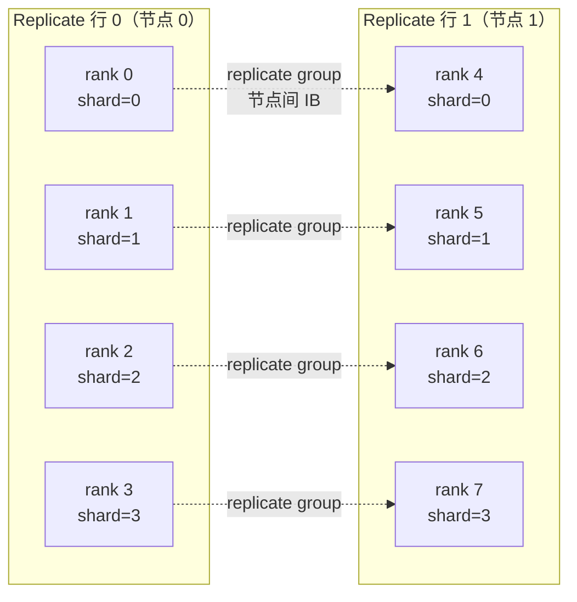

# HSDP 训练（多机）

DMuon **原生支持 HSDP**：你提供一个 `(replicate, shard)` 二维 device mesh，把它传给 `dedicate_params`，DMuon 会在原有 shard 维通信基础上处理跨 replicate 维的 reduce + broadcast。默认开启的异步模式会把每一步的 post-step broadcast 隐藏进下一次 forward 里。

本文走一遍 HSDP 用法、讲一下底层逻辑、给出同步 / 异步两种模式的选择建议。

!!! info "什么时候该用 HSDP"
    HSDP 的收益从**多机训练**开始显现（典型配置 `replicate_size ≥ 2`，每个 replicate 行在不同物理机）。单机多卡直接用 1D shard-only mesh 更简单，速度相当。

---

## TL;DR — 5 行 HSDP 集成

```python
import dmuon
from torch.distributed.device_mesh import init_device_mesh
from torch.distributed.fsdp import fully_shard

hsdp = init_device_mesh(
    "cuda", (replicate_size, shard_size),
    mesh_dim_names=("replicate", "shard"),
)

dmuon.dedicate_params(
    model, hsdp["shard"],
    predicate=lambda n, p: "proj" in n and p.ndim == 2,
    replicate_mesh=hsdp["replicate"],      # ← HSDP 开关
)

for layer in model.layers:
    fully_shard(layer, mesh=hsdp)          # ← FSDP2 吃完整 2D mesh
fully_shard(model, mesh=hsdp)

optimizer = dmuon.Muon(
    model, lr=0.02, momentum=0.95,
    replicate_async=True,                  # 默认：异步隐藏 broadcast
)
```

API 变动就这一个 kwarg，其他训练流程不变。

---

## 快速参考

| 参数 | 位置 | 含义 |
|---|---|---|
| `dedicate_params` 的 `mesh` | `dmuon.dedicate_params(model, mesh, ...)` | 1D shard mesh（广播的列） |
| `replicate_mesh` kwarg | `dmuon.dedicate_params(..., replicate_mesh=...)` | 1D replicate mesh — 传了即开启 HSDP |
| `fully_shard` 的 `mesh` | `fully_shard(layer, mesh=hsdp)` | FSDP2 的 HSDP 由完整 2D mesh 驱动 |
| `Muon` 的 `replicate_async` | `dmuon.Muon(..., replicate_async=True)` | 默认 `True`，broadcast 异步隐藏；`False` 退回 Phase B 同步版本，bit-identical |

---

## 2D Mesh 的含义

HSDP 的两个维度：

- **`shard`**：每个 replicate 行内部参数沿该轴分片（FSDP-ZeRO2/3 行为）
- **`replicate`**：整套 shard 布局沿该轴**复制** —— 每个 replicate 行是一份独立的完整模型实例



```text
示例：init_device_mesh("cuda", (2, 4), mesh_dim_names=("replicate", "shard"))

             shard=0   shard=1   shard=2   shard=3
replicate=0  rank 0    rank 1    rank 2    rank 3     ← shard_group A (节点内 NVLink)
replicate=1  rank 4    rank 5    rank 6    rank 7     ← shard_group B (节点内 NVLink)
             └─ shard=0 列的 replicate_group ─┐
                 (节点间 IB)                    │
                 {rank 0, rank 4}              │
```

每个 rank 恰好在一个 `shard_group`（大小 = `shard_size`）和一个 `replicate_group`（大小 = `replicate_size`）。DMuon 两种都用：shard 维通信承担每层的 broadcast/reduce，replicate 维通信承担 post-step 参数同步。

!!! tip "`mesh_dim_names` 很重要"
    DMuon 的 checkpoint 代码依赖 `"shard"` / `"replicate"` 这两个 dim name 来 compose FSDP2 的 2D all-gather。请按这两个名字写。

---

## 底层发生了什么

每个 Muon-target 参数都有**单一 global owner** —— 坐标 `(owner_shard, owner_replicate)` 的那个 rank。它独占：authoritative `_owned_data` + momentum buffer + 执行 Newton-Schulz。

每步训练：

1. **Forward**: 每层 `_pre_forward` hook 先等 pending 的 async replicate broadcast，再触发 owner 所在 shard 列的 broadcast（每个 packed buffer 一次 NCCL）
2. **Backward**: 两阶段 reduce 把 grad 送到 global owner —— 先沿 shard 轴 `AVG`，再沿 replicate 轴 `AVG`。总除数 `G·R`，等价于对整个 world 一次性 all-reduce。非 owner rank 释放 grad
3. **`optimizer.step()`**: 只有 global owner 运行 NS + momentum + weight-decay + update，在它本地的 `_owned_data` 上
4. **Post-step broadcast**: 更新后的 `_owned_data` 通过 `replicate_group` 发给 owner shard 列内其他 rank。默认 `replicate_async=True`：dispatch 在专用 stream 上，wait 延迟到下一次 iteration 的第一个 `_pre_forward` 消费 —— 所以 broadcast 就隐藏在 forward 计算里

整条流程无论 `replicate_async=True/False` 都是 bit-identical 的；async 只是把 wait 推后。

---

## 同步 vs 异步模式

| 模式 | `replicate_async` | 何时用 | 风险 |
|---|---|---|---|
| **同步（Phase B）** | `False` | 调试、checkpoint 检查、需要可预测时序 | 无 —— 永远正确 |
| **异步（Phase C，默认）** | `True` | 生产训练、大模型、多机 | 如果 replicate 带宽远慢于 forward 计算，broadcast 藏不进去；调试时可切回同步模式 |

### 异步语义

异步模式下，post-step replicate broadcast 在 dedicated replicate stream
上发起，并由每个 group 下一次 forward entry 消费。公开运行时只保留一个
明确开关：`replicate_async=True` 走 overlap 路径；调试需要确定 step
边界时使用 `False`。

通常 `p90 < 100 μs` 表示 async 隐藏良好。`p99` 尾部偏长时，检查：(a) replicate 带宽是否被打满（IB saturation），(b) forward 计算时间是否够短到没得藏。

---

## 正确性保证

DMuon 的 HSDP 路径都和 1D shard-only 路径做了对齐：

- **10 步 loss bit-identical**（4 GPU，G=2, R=2，对齐 shard-only DMuon）
- **checkpoint restart bit-identical**（中途保存 → 新进程加载 → 继续训练和不中断完全一致）
- **sync vs async bit-identical** —— 异步 event 路径和同步路径产出完全相同的 optimizer state

对应测试文件在仓库里 —— `tests/distributed/test_hsdp_correctness.py`、`test_hsdp_async_correctness.py`、`test_hsdp_restart.py`，用 `torchrun --nproc_per_node=4` 可复现。

---

## HSDP 下的 checkpoint

保存 / 加载和 1D 完全一致 —— [`get_model_state_dict`](../reference/api.md) / [`set_model_state_dict`](../reference/api.md) 自动识别 2D mesh 并从 shard 轴子组 all-gather。读 state dict 前会先 drain 任何 pending 的 async replicate broadcast：

```python
# 保存
model_sd = dmuon.get_model_state_dict(model)         # 先 drain async broadcast
optim_sd = dmuon.get_optimizer_state_dict(model, optimizer)
if dist.get_rank() == 0:
    torch.save({"model": model_sd, "optim": optim_sd}, "ckpt.pt")

# 恢复（相同 HSDP 拓扑）
ckpt = torch.load("ckpt.pt", map_location=device, weights_only=False)
dmuon.set_model_state_dict(model, ckpt["model"])
dmuon.set_optimizer_state_dict(model, optimizer, ckpt["optim"])
```

!!! warning "跨拓扑 restore"
    DMuon 的 HSDP checkpoint 当前假设恢复时 `(shard_size, replicate_size)` 不变。跨拓扑恢复暂不支持 —— 可离线走：`get_model_state_dict` → 单进程保存完整 state dict → 新拓扑下重 init + `set_model_state_dict`。

---

## DMuon-Z2 vs DMuon-Z3（packed buffer 生命周期）

DMuon 通过 `dedicate_params()` 自己的 `reshard_after_forward` kwarg，暴露和 FSDP2 同样的 memory-vs-comm tradeoff。这个参数控制 **Muon-target 的 packed buffer** 是否在 fwd 和 bwd 之间保持常驻（与 FSDP2 对 non-Muon 参数的同名 flag 思路一致，只是作用于 DMuon 自己的 buffer）。

| 模式 | `reshard_after_forward` | 行为 | Muon-target 字节/步 | Muon-target 显存 |
|---|---|---|---|---|
| **DMuon-Z2** | `False` | packed buf 在 fwd+bwd 之间常驻；backward 直接复用 | `2(N-1)/N · P_M`（comm 最优）| P_M 每 shard rank 常驻 |
| **DMuon-Z3** | `True`（默认）| packed buf 在 fwd 后 reshard；backward 进入重广播 | `3(N-1)/N · P_M` | 每 rank 单层 packed buf transient |

```python
# DMuon-Z3（默认）—— 推荐大模型（7B+），匹配 FSDP2 ZeRO-3 显存模型
dmuon.dedicate_params(
    model, hsdp["shard"],
    predicate=lambda n, p: "proj" in n and p.ndim == 2,
    replicate_mesh=hsdp["replicate"],
)

# DMuon-Z2 —— 中小模型 opt-in，通信占主导且 packed bufs 放得下
dmuon.dedicate_params(
    model, hsdp["shard"],
    predicate=lambda n, p: "proj" in n and p.ndim == 2,
    replicate_mesh=hsdp["replicate"],
    reshard_after_forward=False,                # ← DMuon-Z2 模式
)
```

**推荐用法**：让 DMuon 的 `reshard_after_forward` 和 FSDP2 的 `fully_shard(..., reshard_after_forward=...)` 保持一致，让 Muon 和 non-Muon 参数在同一个显存模型下工作：

```python
# 全 ZeRO-3（默认，大模型）
dmuon.dedicate_params(model, hsdp["shard"], ..., replicate_mesh=hsdp["replicate"])
for layer in model.layers:
    fully_shard(layer, mesh=hsdp)                 # FSDP2 default = Z3

# 全 ZeRO-2（comm-optimal，中小模型）
dmuon.dedicate_params(model, hsdp["shard"], ..., replicate_mesh=hsdp["replicate"],
                      reshard_after_forward=False)                             # DMuon-Z2
for layer in model.layers:
    fully_shard(layer, mesh=hsdp, reshard_after_forward=False)                 # FSDP2 Z2
```

非对称组合（DMuon-Z2 + FSDP2-Z3 或反过来）合法且偶尔最优（例如 Muon 参数数量少但单个大 → DMuon-Z2；non-Muon 参数多但单个小 → FSDP2-Z3），但增加心智成本。推荐从对称 config 开始。

---

## 故障排查

**`RuntimeError: Guessing device ID based on global rank`**
: 较新 PyTorch 的警告而已。给 `dist.init_process_group` 传 `device_id=torch.device("cuda", local_rank)` 可消除。

**N 步后 async loss 发散但 sync 正常**
: 几乎不可能（bit-identical 测试已覆盖）。真遇到先用 `replicate_async=False` 复现确认，然后带上 NSight profile 开 issue。

**owner rank 在 HSDP 下 OOM**
: LPT 在 **shard rank 之间**均衡 owner 负载，但单个 rank 还是要持所有被它拥有参数的 full param + grad + state。调 `dmuon.partition.SMALL_PARAM_THRESHOLD` 或增大 `shard_size`。

**`optimizer.step` 窗口内 IB 看起来打满**
: 对比 `replicate_async=True` 和 `False`，再用 torch profile 检查 post-step
  publish 是否藏进下一轮 forward。如果无法隐藏，减少 post-step publish
  payload，或在诊断 run 中使用同步模式。

---

## 相关文档

- [核心概念](../getting-started/concepts.md) —— dedicated ownership 如何和 FSDP2 组合
- [训练流程](training.md) —— 完整 1D shard workflow（先掌握这个，再加 HSDP 上面几个 knob）
- [检查点](checkpoint.md) —— state-dict 语义
- [自定义 Hook 边界](custom-hook-boundaries.md) —— 让 DMuon hook 边界与模型结构对齐
- [Z2 与 Z3 模式](z2-z3-modes.md) —— packed buffer 生命周期与显存/通信权衡
- [集成方案](integration-recipes.md) —— HuggingFace Trainer、torchtitan 等框架集成
- [API 文档](../reference/api.md) —— 完整 `dedicate_params` 和 `Muon` 签名
